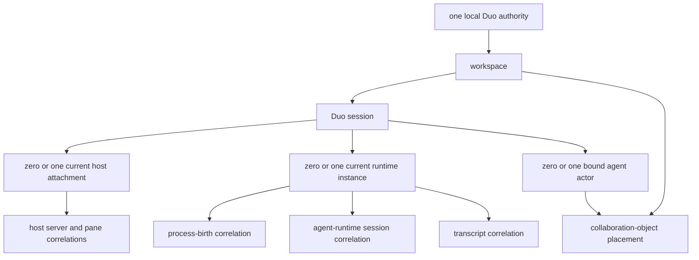
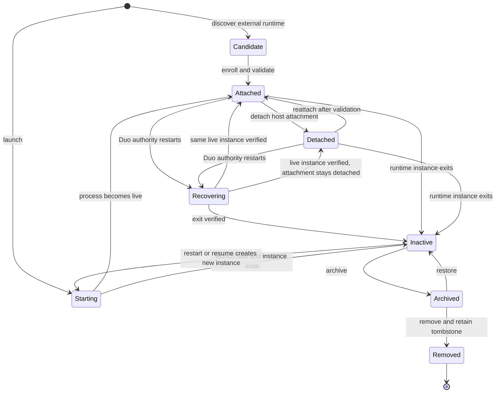
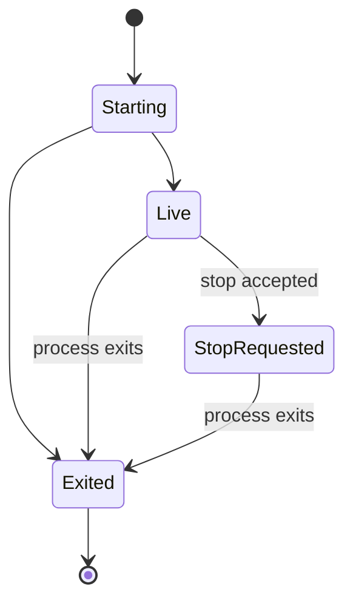

<!-- Snapshot from the terminal-multiplexers archive at its 2026-09 freeze
     (handoff 27, repo-consolidation Stage B). Authored here from now on.
     Relative links that do not resolve in this repo refer to the archive;
     cite it by tag, not branch. -->

# Duo vNext decision 01: identity and lifecycle

> Status: **locked by Session 1 on 2026-08-12.**
>
> Completion gate: **passed.**

## 1. Problem and boundary

Duo needs one durable handle for an interactive agent activity even when the
host, process, transcript, or agent runtime uses a different identifier. The
handle must survive a Duo restart. It must also distinguish two live agent
processes that use the same agent and working directory.

This decision defines identity, correlation, ownership, enrollment, and
lifecycle meaning. It does not define Go packages, public wire fields, CLI
names, MCP names, or final external schemas. Sessions 2 and 3 own observation
ranking and command results. Session 4 owns collaboration-object operations.
The Session 6 specifications own the implementation sequence and advancement
trigger for a protocol-owned integration.

## 2. Evidence used

| Status | Evidence | Consequence |
|---|---|---|
| **Finding** | The current Herdr Chat View adapter derives a display ID from the Herdr socket path and pane ID. It uses Herdr's agent-session report to resolve a transcript and does not guess when the report is absent. | The adapter proves that host and agent identifiers are useful correlations. Its derived display ID is not a durable Duo identity. |
| **Finding** | Claude SessionStart reports an agent session ID, transcript path, and working directory. The current mini-mux prototype routes by working directory and keeps one transcript per watched session. Repository findings state that two same-directory sessions need per-session routing. | A working directory can find candidates, but it cannot bind a transcript to a Duo session. An exact, authenticated instance claim is required. |
| **Finding** | A disposable tmux 3.4 probe on 2026-08-12 kept pane ID `%0` across `respawn-pane`. The process birth changed from `2788451:68240312` to `2788457:68240314`. | A pane identifies a host container. A process restart in that pane creates a new runtime instance. |
| **Finding** | The installed Herdr version remains 0.7.5. The Session 1 environment has no installed Solo command, and the repository has no completed Solo live-surface probe. | Herdr evidence remains version-pinned. Solo identity and recovery details remain a gap. |
| **Finding** | Repository hook probes show that reports can arrive late or disappear at process exit. | Process lifecycle evidence must outrank late agent reports. An exited runtime instance cannot return to a live state. |

## 3. Accepted identity model

### 3.1 Hierarchy

One local Duo authority issues every primary Duo ID. A workspace contains Duo
sessions and gives collaboration objects a placement boundary. A Duo session
is the primary public runtime object. It can have a sequence of runtime
instances. A host attachment, terminal, process, transcript, and external
agent session are correlations or associated resources. None is the Duo
session's identity.

The initial integration taxonomy has two independent roles:

- A session-host integration supplies host discovery, lifecycle, terminal, or
  control behavior.
- An agent-runtime integration supplies agent identity, conversation,
  condition, usage, or native control behavior.

An initial terminal-hosted session has one session-host integration and zero or
one recognized agent-runtime integration. The general identity model permits
zero session-host integrations. A future protocol-owned Duo session can
therefore exist without a terminal. *Amendment (Session 6, 2026-08-13, marked
by the 2026-08-14 review):* Session 6 accepts a third protocol-owned
integration role instead of a distinct public session species.

### 3.2 Accepted terms

| Term | Accepted meaning |
|---|---|
| **workspace** | A durable Duo-owned local work context. It has an opaque ID and one current root-path correlation. It groups sessions and collaboration objects. A path is not its identity. |
| **Duo session** | The primary public runtime object. It represents one continuing interactive agent activity and has one stable opaque Duo ID. It can have sequential runtime instances and can exist without a terminal. |
| **runtime instance** | One execution generation that realizes a Duo session. It has a Duo-issued ID. Process exit ends it permanently. A process replacement creates a new runtime instance, even when the host pane stays the same. |
| **agent actor** | An optional durable Duo identity for one agent participant. It can receive work and author changes across sequential Duo sessions and runtime instances. It is not an OS process, external agent session, or Duo session. |
| **host attachment** | The current relationship between a Duo session and a session-host container. It can outlive one runtime instance and can be attached or detached without changing the Duo session ID. |
| **discovery candidate** | A transient description of an external runtime that might be enrolled. It has no durable public Duo ID and does not become a Duo session until enrollment succeeds. |
| **correlation record** | A Duo-owned, time-bounded claim that relates a Duo object to an external identifier or path. It records scope, source, proof, verification time, and status. |

### 3.3 Workspace identity and paths

Duo assigns a workspace ID. Duo records the normalized root path as a current
correlation. Duo can also record filesystem identity and repository or
worktree evidence when those values are available.

Within one authority, one normalized current root maps to one active workspace.
An enrollment request for the same root returns the existing workspace. A path
rename, mount change, or directory replacement does not silently create or
transfer workspace identity. Duo requires an explicit, audited path rebind when
the available filesystem evidence cannot prove continuity.

Sessions in the same working directory share a workspace by default. They
remain distinct because session and runtime-instance identity never uses the
workspace path as a uniqueness key.

*Amendment (2026-08-24 handoff 22, `notes/43-config-v3-change-control.md`
record 6).* Under `duo.config/v3` a workspace also carries a rebindable
workspace↔host-instance correlation, and it copies the shape of the path
rebind above. It is current correlation state and not an identity. It is
written at first launch, carrying its `host_source` provenance and the
notes/19 §5 fingerprint set (session name, pane ID, terminal ID, process
info). It is consulted at launch materialization. A host instance whose
evidence cannot prove continuity does not silently transfer the correlation:
the change requires an explicit audited rebind verb
(`duo workspace host rebind`, with `duo workspace host show` as the read
verb), which records the old and the new instance with their fingerprints and
never runs implicitly.

### 3.4 Agent actor binding

A Duo session has zero or one bound agent actor. A binding identifies who can
receive durable work and author attributable collaboration changes. It does not
claim that a process or external agent account owns the Duo session. An agent
actor can bind to sequential Duo sessions.

The initial model permits one live runtime binding for an agent actor at a
time. A second concurrent binding is a conflict unless a later design adds an
explicit multi-instance actor policy. This rule keeps inbox delivery and
authorship unambiguous.

Duo accepts a binding only from one of these sources:

- An explicit owner or administrator action.
- A launch or resume plan that already names the actor.
- An authenticated, instance-scoped claim that Duo issued for the launch or
  enrollment.

An external agent-session ID, transcript path, working directory, process ID,
or pane ID cannot bind an agent actor by itself.

### 3.5 Ownership

The Duo authority is the record authority for workspaces, sessions, runtime
instances, actor bindings, correlations, and collaboration-object identity.
External systems remain authoritative for their own runtime facts.

Each Duo session has one owning subject and an attributable creator. The owner
can manage lifecycle when policy grants that operation. Session ownership does
not imply ownership of the host process or terminal.

Each collaboration object has workspace placement, one owning durable subject,
and attributable authors. A human actor, agent actor, or automation actor can
be an owner. A Duo session and a runtime instance are objects, not durable
ownership subjects. Session 4 adds sharing and transfer rules without changing
these identities.

### 3.6 ID authorities, visibility, and lifetime

| ID or locator | Issuer or authority | Ordinary visibility | Lifetime and reuse rule |
|---|---|---|---|
| Duo authority ID | Duo installation | Privileged diagnostics | Survives authority-process restarts. A restored store keeps it. |
| Authority incarnation ID | Duo process | Audit and diagnostics | New for each authority process. Never reused. |
| Workspace ID | Duo authority | Public opaque Duo ID | Survives path changes and Duo restarts. A removed ID stays reserved in a tombstone. |
| Duo session ID | Duo authority | Primary public runtime handle | Survives detach, process exit, restart, resume, archive, and Duo restart. It is never reassigned. |
| Runtime-instance ID | Duo authority | History and diagnostics, with public use when an operation needs exact execution scope | Identifies one execution generation. It is never reused or revived after exit. |
| Agent-actor ID | Duo authority | Public where attribution or collaboration needs it | Survives sequential sessions and runtime instances. It is never inferred from an external agent ID. |
| Correlation-record ID | Duo authority | Privileged diagnostics and history | Survives Duo restart. A retired correlation remains historical and is not reused. |
| Host server, workspace, tab, pane, or process ID | Session host | Diagnostics when authorized | Scoped by integration instance, host server epoch, object kind, and validity interval. Never a primary Duo handle. |
| OS process locator | OS or session host | Privileged diagnostics | Uses a process-birth tuple, such as boot or host epoch, PID, and start time. PID alone is insufficient. |
| Agent-runtime session ID | Agent runtime | Diagnostics and agent-specific correlation | Scoped by runtime integration and installation or profile. It can correlate with sequential runtime instances, but it never replaces their IDs. |
| Transcript locator | Agent runtime and filesystem | Diagnostics when authorized | Uses the reported session identity plus path and file evidence where available. A path alone is not unique or permanent. |
| Reporter enrollment credential | Duo authority | Secret, never listed as identity | Scoped to one authority, session, and runtime instance. Rotate or retire it after exit or policy change. |

## 4. Correlation and enrollment rules

### 4.1 Correlation records

Each correlation record contains these semantic fields:

- The target Duo object.
- The external kind, value, and integration scope.
- The source and evidence that made the claim.
- The first and last verification times.
- A validity interval.
- One status: active, stale, conflicted, or retired.

Host server and pane correlations normally target the host attachment. Process
birth correlations target a runtime instance. Agent-runtime session and
transcript correlations target a runtime instance. The same external agent
session or transcript can have sequential correlation records when an explicit
resume continues it in a new runtime instance.

A correlation can help resolve a Duo object. It cannot become that object's
public identity. Diagnostics can expose correlations only under the applicable
permission and redaction policy.

### 4.2 Duplicate-enrollment prevention

The local Duo authority maintains an atomic active-claim index. The strongest
available live-runtime fingerprint forms the claim. A terminal-hosted
fingerprint includes:

- The configured session-host integration instance.
- The host server epoch or equivalent server identity.
- The exact host container, such as a pane.
- The process-birth identity for the agent execution when it is available.

An authenticated reporter claim can strengthen the fingerprint with an agent
runtime session ID and transcript identity. A working directory, command name,
agent name, transcript modification time, or PID alone is never sufficient.

Enrollment is one atomic operation:

1. Revalidate the discovery candidate.
2. Look up active claims and unresolved recovery reservations.
3. Return the existing Duo session when the same live runtime is already
   enrolled.
4. Create the session, runtime instance, correlations, and active claims in one
   durable transaction when no claim exists.
5. Record a conflict and leave the candidate unenrolled when evidence overlaps
   two Duo sessions or cannot distinguish live runtimes.

A conflict never causes an automatic merge. An owner must resolve stale or
contradictory claims. A detached or temporarily unreachable live runtime keeps
its active reservation. An exited instance releases the active claim but keeps
its historical correlations.

### 4.3 Stale correlations

Duo marks a correlation stale when it misses its verification deadline or its
integration becomes unreachable. Stale does not mean exited. A stale
correlation cannot support a new destructive or ownership-changing action
without revalidation.

Authoritative exit evidence retires all live process claims for the runtime
instance. A reused pane ID, PID, transcript path, or external agent-session ID
must create a new correlation record. It must not reopen the old runtime
instance.

When only weak evidence is available, Duo can show a discovery candidate or an
unresolved session. Duo must not guess a correlation. In particular, Duo must
not select the newest transcript for a working directory when more than one
runtime can match.

### 4.4 Recovery after a Duo restart

The authority reloads durable Duo IDs, active claims, lifecycle facts, and
correlation history. It assigns a new authority incarnation ID. It places each
previously live runtime instance in a recovering view until validation
finishes.

Recovery uses these rules:

1. When the host proves that the same host object and process birth remain
   live, Duo keeps the same runtime-instance ID and reactivates its
   correlations.
2. When the host proves exit, Duo records exit and makes the instance final.
3. When the host object remains but process birth changed, Duo exits the old
   instance. Duo creates a new instance only when an explicit restart or resume
   policy proves session continuity.
4. When the host is unreachable, Duo reports the session as disconnected or
   unresolved. It keeps the claim reservation and does not infer exit.
5. When recovery finds a conflicting live claim, Duo quarantines both claims
   from automatic control until an owner resolves the conflict.

Workspace, Duo-session, agent-actor, correlation-record, and still-live
runtime-instance IDs can survive an authority restart. Authority incarnation,
connection, discovery-candidate, and expired enrollment-credential IDs cannot.

## 5. Lifecycle model

### 5.1 Session and runtime states

`Candidate` is not a persisted Duo-session state. `Recovering` is a current
view during authority startup. The durable session states are active with an
attached or detached host, inactive, archived, and removed. One active session
has at most one current runtime instance.

A runtime instance has these allowed states:

`Exited` is terminal. Stop is a request, not proof of exit. Detach changes the
host attachment. Detach does not stop the process or end the runtime instance.

### 5.2 Lifecycle verbs

| Verb | Accepted transition and effect |
|---|---|
| **discover** | Observe an external runtime and create or refresh a transient candidate. Discovery does not claim, control, or assign a durable public ID. |
| **enroll** | Atomically adopt one validated live runtime. Enrollment creates or selects a workspace, creates a Duo session and runtime instance, and claims the live fingerprint. Repeating enrollment returns the existing Duo session. |
| **launch** | Create a Duo session and starting runtime instance, then ask an integration to start the execution. A failed launch exits that instance and leaves an inactive session with failure history. |
| **bind** | Add a verified relationship between a session, its runtime instance, an optional agent actor, and external correlations. Binding does not create or revive a process. |
| **resume** | Continue an inactive Duo session or durable agent actor in a new runtime instance. Resume needs explicit owner intent, a trusted continuation token, or equally strong integration proof. |
| **restart** | End the old runtime instance and create a new runtime instance in the same Duo session under an explicit restart policy. A host container can stay attached. Runtime-instance IDs never carry across the boundary. |
| **detach** | Disable Duo's active host attachment while the external runtime can continue. Keep the session, runtime instance, claims, and history. |
| **reattach** | Revalidate a detached host and process, then restore observation or control without changing a still-live runtime-instance ID. |
| **stop** | Request that the current runtime instance stop. Record the request and result. Do not report exit until process-lifecycle evidence proves it. |
| **exit** | Record the final end of one runtime instance from authoritative process or host evidence. Exit closes active process claims. It does not remove the Duo session. |
| **archive** | Move an inactive session out of ordinary active use while retaining its identity, history, ownership, and correlations. A session with a live instance cannot be archived. |
| **removal** | Remove an archived session from ordinary access and retain a minimal tombstone that prevents ID reuse and explains references. Removal is terminal in the initial model. |

An authority-process restart is recovery, not an agent restart. A host restart
can either preserve an instance or end it. Duo decides from verified process
continuity, not from the word `restart` or reuse of a host ID.

### 5.3 Exit finality and late evidence

An accepted exit fact is final for its runtime instance. Each observation keeps
its source time, receive time, source sequence when available, and target
instance. After exit:

- A late observation can enrich history before the recorded exit time.
- A late observation cannot change the current instance to starting, live,
  working, blocked, idle, or done.
- A late SessionStart claim can create a new discovery conflict or identify a
  new runtime instance. It cannot revive the exited instance.
- A new process in the same pane always needs a new runtime-instance ID.

Session 2 defines evidence ranking within a live runtime instance and preserves
this finality rule.

## 6. Required scenario walkthroughs

### 6.1 Discover an existing Claude Code process in tmux and enroll it once

The tmux integration reports a candidate with the tmux integration instance,
server epoch, pane ID, and the best available process-birth evidence. The
working directory and `claude` command are hints only. Enrollment revalidates
the candidate and atomically claims the live fingerprint.

A second discovery returns the existing Duo-session ID. If a SessionStart
report later supplies the agent session and transcript, an authenticated claim
adds those correlations to the existing runtime instance. Duo leaves a report
unbound when it cannot match the report exactly. Duo does not create a second session or
select a transcript by directory modification time.

### 6.2 Launch an agent through Solo and correlate a later SessionStart report

Duo creates its session and runtime-instance IDs before the Solo launch call.
It records the returned Solo process ID as an external correlation, scoped to
the Solo integration instance. Duo also issues an instance-scoped enrollment
credential or records an equivalent trusted launch claim.

The later SessionStart report adds the agent-runtime session ID and transcript
correlation to the existing runtime instance. The Solo process ID and agent
session ID remain diagnostic correlations. Neither becomes the Duo-session ID.
The exact Solo process-birth, working-directory, and binding surface remains a
live-evidence gap.

### 6.3 Restart Duo while a Herdr session continues

Duo reloads the workspace, session, runtime-instance, actor, and correlation
IDs from durable storage. It starts a new authority incarnation and validates
the Herdr server, pane, and process evidence. When Herdr proves the same live
execution, Duo keeps the existing runtime-instance ID. When Herdr is
temporarily unreachable, Duo keeps the claim reserved and reports an unresolved
or disconnected view. It does not enroll the pane again.

### 6.4 Restart an agent process in an existing terminal pane

The pane correlation and host attachment can remain on the Duo session. The old
process exit closes the old runtime instance permanently. The new process birth
creates a new runtime instance. Duo keeps the Duo-session ID only when an
explicit restart or resume policy establishes continuity. Pane ID reuse alone
cannot establish continuity.

### 6.5 Run two same-agent sessions in one working directory

Both sessions reference the same workspace. Each session has its own Duo ID,
runtime-instance ID, process-birth correlation, and authenticated reporter
claim. Each SessionStart report carries a distinct external agent-session ID
and transcript correlation.

The working directory never selects between them. If Duo receives an old hook
without an instance-scoped claim and cannot prove the target, Duo reports a
correlation conflict. It does not use newest-transcript or last-hook-wins
routing.

*Cross-reference (2026-08-24 handoff 22, `notes/43-config-v3-change-control.md`
record 6).* The `duo.config/v3` workspace↔host-instance correlation does not
weaken this rule. That correlation routes **new spawns** only: it deduces which
session-host instance a launch that does not yet exist materializes against,
before any session ID exists. It never claims, merges, or selects the identity
of a live session, and it never routes a hook or a report between the two
sessions above. §6.5 stands unchanged.

### 6.6 Resume one durable agent actor in a new runtime instance

The old runtime instance exits. The inactive Duo session keeps its owner,
history, and actor binding. An explicit resume creates a new runtime-instance
ID and binds the same agent-actor ID. A resumed external agent session or
transcript becomes a new, sequential correlation record. Unacknowledged inbox
entries continue to target the agent actor, not the exited process.

### 6.7 Observe process exit followed by a late hook report

The process supervisor or host records exit for the runtime instance. A queued
hook arrives later with the old instance credential or external identity. Duo
stores the observation with both timestamps and can place it in pre-exit
history. The current runtime instance remains exited. The hook cannot release a
stop request, create a live claim, or change the current session condition.

## 7. Lifecycle facts and audit history

Duo keeps durable, attributable facts for these changes:

- Workspace creation, root-path claim, rebind, and conflict.
- Session creation, enrollment, launch, owner change, detach, reattach,
  archive, restore, and removal.
- Runtime-instance start, live verification, stop request, stop result, exit,
  and recovery decision.
- Agent-actor creation, binding, unbinding, resume, ownership use, and conflict.
- Correlation claim, verification, stale marking, conflict, replacement, and
  retirement.
- Duplicate-enrollment decisions and manual conflict resolutions.
- Reporter enrollment, credential rotation, rejected spoofing attempts, and
  late reports after exit.

Each fact records the responsible actor or subsystem, target Duo IDs, time,
source evidence, authority incarnation, and reason. Ordinary history can omit
sensitive external values. Privileged diagnostics can retain those values.

## 8. Rejected alternatives

| Alternative | Reason for rejection |
|---|---|
| Use a Solo process ID, Herdr pane ID, tmux pane ID, transcript path, or agent-runtime session ID as the public handle. | The value has an external authority, scope, and lifetime. It can change or be reused while the Duo activity continues. |
| Use a working-directory path as workspace or session identity. | Paths move, alias, and can be replaced. Multiple valid sessions can use one path. |
| Treat a terminal or pane as the Duo session. | A pane can outlive several processes. A future session can have no terminal. |
| Treat every process found in a known directory as enrolled. | Discovery would become an unsafe ownership claim and would create duplicates. |
| Bind the newest transcript in a directory. | Two same-directory sessions can race and misbind. Copied or resumed transcripts make modification time weaker still. |
| Revive an exited runtime instance when a late hook reports activity. | Process exit is stronger lifecycle evidence. Revival corrupts history and can route control to a replacement process. |
| Reuse one runtime-instance ID across a process restart in the same pane. | The tmux probe proves that the pane can stay constant while process birth changes. |
| Make the agent actor identical to a Duo session. | Durable collaboration delivery and authorship must survive sequential sessions and runtime instances. |

## 9. Consequences and remaining triggers

The public model needs durable storage before it can safely enroll external
runtimes. Integrations need exact process-birth and host-server epoch evidence
where the platform permits it. Generated reporters need authenticated,
instance-scoped enrollment. Presentations can show external correlations for
diagnosis, but they must route ordinary operations through the Duo-session ID.

These evidence gaps remain:

- Probe Solo's current transport, process-birth evidence, working-directory
  data, restart behavior, and agent-session binding.
- Probe tmux pane identity across server restart, move, rename, linking, and
  foreground child changes. The Session 1 probe covers `respawn-pane` only.
- Reverify Herdr server-epoch identity and process continuity across live
  handoff or server restart. The installed version is still 0.7.5.
- Reverify current SessionStart and session-identity schemas for Claude Code,
  Codex, OpenCode, and Pi before implementation conformance freezes them.
- *Amendment (Session 6, 2026-08-13, marked by the 2026-08-14 review):* apply
  the accepted protocol-owned advancement trigger and conformance duties
  in [`duo-vnext-implementation-roadmap.md`](./duo-vnext-implementation-roadmap.md),
  a Session 6 deliverable. A terminal remains optional.

None of these gaps changes the primary identity or exit-finality decision. An
adapter that lacks strong evidence must degrade to a candidate, unresolved
correlation, or explicit conflict. It must not guess.

## 10. Completion-gate assessment

**Passed.** Herdr, Solo, and tmux enroll or identify runtimes through scoped
correlation records while callers use an opaque Duo-session ID. The model gives
each same-directory runtime a distinct session, runtime instance, process-birth
claim, and reporter claim. An exit fact is final even when a hook arrives late.
A Duo session has an optional host attachment and optional terminal, which
preserves the future protocol-owned seam.

*Amendment (Session 2, 2026-08-12, marked by the 2026-08-14 review):*
Session 2 accepted these terms as inputs: workspace, Duo session, runtime
instance, agent actor, host attachment, discovery candidate, and correlation
record. It preserves active-claim uniqueness, instance-scoped observation
routing, and exit finality.
