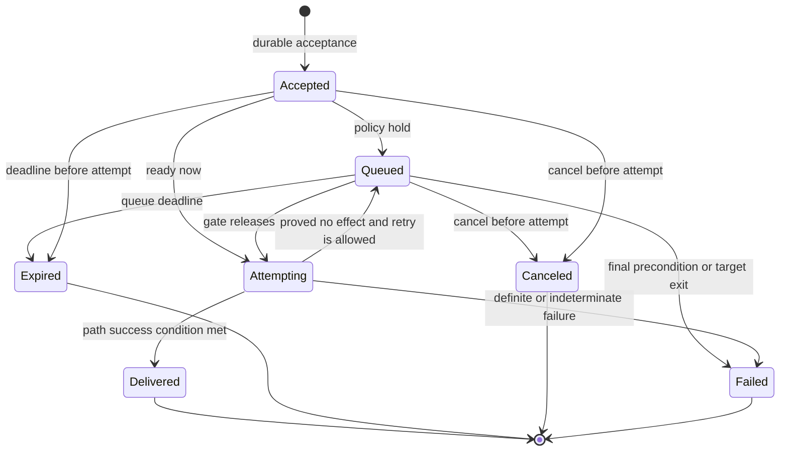

<!-- Snapshot from the terminal-multiplexers archive at its 2026-09 freeze
     (handoff 27, repo-consolidation Stage B). Authored here from now on.
     Relative links that do not resolve in this repo refer to the archive;
     cite it by tag, not branch. -->

# Duo vNext decision 03: control and delivery

> Status: **locked by Session 3 on 2026-08-12.**
>
> Completion gate: **passed by contract walkthrough.** Solo still needs a live
> conformance probe before its adapter can advertise exact prompt delivery.

## 1. Problem and boundary

Duo must accept one semantic command and preserve its meaning across native
agent methods, host input methods, and synthesized terminal input. The caller
must be able to distinguish admission, queueing, an external delivery attempt,
transport success, observed activity, and explicit acknowledgment.

This decision defines command identity, idempotency, preconditions, prompt
arbitration, path selection, attempts, outcomes, restart recovery, shared
control errors, and audit requirements. It does not define Go packages, wire
fields, CLI names, MCP tools, or presentation routes. The Session 4 decision
uses this model for collaboration activation. The Session 5 and Session 6
specifications define public spellings, adapter interfaces, and conformance.

Prompt delivery remains separate from terminal input. A prompt command requests
one complete agent turn. It never exposes paste, key, or submit recipes as part
of its public meaning. Stop, interrupt, wait, and terminal input also keep their
own operation boundaries.

## 2. Prerequisites and evidence

The Session 1 and Session 2 completion gates passed. This decision therefore
preserves these locked rules:

- A command targets an opaque Duo-session ID and one exact runtime instance.
- Process exit is final for that runtime instance.
- Commands, observations, current views, and stream delivery are separate.
- Operation support reports availability, quality, realization, constraints,
  and authorization independently.
- Activity requires a qualifying observation. Delivery does not imply activity.
- Heuristic evidence does not satisfy a reported-evidence precondition unless
  policy explicitly permits heuristic quality.

Session 3 used this evidence:

| Status | Evidence | Consequence |
|---|---|---|
| **Locked** | Sessions 1 and 2 fixed runtime-instance identity, exit finality, command-channel separation, observation ranking, and operation support. | A queued command cannot migrate to a replacement process. Delivery results cannot update session condition by themselves. |
| **Finding** | Herdr 0.7.5 remains installed. Its exported API schema has the same SHA-256 digest as `notes/05-herdr-schema-0.7.5.json`. | The pinned `agent.prompt`, wait, timeout, and error shapes remain current evidence. |
| **Finding** | Herdr 0.7.5 accepts a whole prompt through `agent.prompt`. Prior live probes observed `agent_prompt_stalled`, `agent_pane_busy`, and condition waits. | Herdr can provide a native prompt path. Its wait result is condition evidence, not target acknowledgment. A stall does not prove that retry is safe. |
| **Finding** | The handoff-13 probe showed that Claude Code and OpenCode native prompt paths preserve the terminal composer but can start immediately while a human draft is pending. | Composer safety does not remove the human-turn arbitration gate. |
| **Finding** | The mini-mux prototype attributes human and injected input. A positive human byte count never under-held in its tested model. Escape and line-clear operations can cause an over-hold. | Exact source attribution can create a hard draft hold. An authorized human needs a visible way to release a known over-hold. |
| **Finding** | A disposable tmux 3.4 Session 3 probe merged `echo human` and `echo injected` into one shell line. Two identical sends produced two executions. `send-keys` returned success before any semantic result existed. | Plain tmux has no prompt transaction, input idempotency, or agent acknowledgment. Duo must arbitrate before synthesis and must not retry an uncertain attempt. |
| **Gap** | No Solo command is installed, and no live Solo prompt or restart probe exists in the repository. | Solo `send_input` remains reported evidence. Its adapter must report degraded or unavailable support until a live conformance record proves submit, collision, failure, and restart behavior. |

The disposable tmux probe used a private socket and server. It did not attach to
or modify a live user session.

## 3. Accepted command model

### 3.1 Command envelope

A **command** is a durable record of one accepted semantic request. Duo creates
the command only after validation and authorization succeed. A rejected request
still creates a security audit record when policy requires one, but it does not
enter the command lifecycle.

Every command has these semantic parts:

| Part | Requirement |
|---|---|
| Identity | A Duo-issued command ID. It is stable for the command lifetime and is never an adapter request ID. |
| Intent | One operation kind and its validated semantic payload. |
| Target | The Duo object ID and, for runtime control, the exact runtime-instance ID bound at acceptance. |
| Attribution | Caller, authenticated subject, authority incarnation, and originating projection or component. |
| Idempotency | A caller-supplied key, its scope, and a digest of the canonical request. |
| Preconditions | Required object versions, runtime instance, lifecycle facts, operation support, minimum quality, allowed realization, and other operation-specific guards. |
| Queue policy | `require-ready`, `queue-until-safe`, or `hold-for-release`. |
| Deadlines | An absolute command expiry and bounded attempt deadlines. Optional observation or acknowledgment waits have separate deadlines. |
| Policy context | The policy and grant versions used at acceptance, plus policy decisions that must be rechecked before an attempt. |
| History | Monotonic command revisions, responsibility transitions, command-attempt records, evidence milestones, and the terminal result. |

The accepted target does not follow the Duo session to a new runtime instance.
When a replacement process starts, a caller must submit a new command for the
new runtime-instance ID.

### 3.2 Idempotency and duplicate prevention

The idempotency scope combines the authenticated caller, semantic operation,
target Duo object, and caller key. Projections can hide this composition, but
they cannot weaken it.

Duo applies these rules:

1. Acceptance stores the command, idempotency record, initial result, and audit
   entry in one durable transaction.
2. The same key and the same canonical request digest return the existing
   command and its current result. Duo does not create a second command.
3. The same key with a different target, payload, precondition, queue policy,
   or quality requirement fails with an idempotency conflict.
4. Idempotency records survive Duo restart. Their retention exceeds the maximum
   queue lifetime and the supported caller retry horizon.
5. An adapter request ID is also scoped to one command attempt. Duo forwards a
   stable attempt token only when the integration supports idempotency or
   result lookup.

Idempotent admission does not make an external transport exactly once. Attempt
recovery uses the effect-certainty rules in Section 7.

### 3.3 Preconditions and acceptance

Duo evaluates immutable and current preconditions before acceptance. It checks
current preconditions again immediately before each attempt.

Acceptance requires all of these conditions:

- The target exists, is visible, and resolves to the intended runtime instance.
- The runtime instance has no accepted exit fact.
- The caller has the operation grant.
- The operation is not unsupported for the composition.
- The request has an absolute expiry later than the current time.
- The requested quality and realization can be met now or can reasonably become
  available before expiry.
- The queue has capacity when the policy permits queueing.

Acceptance means that Duo durably assumes responsibility to attempt, expire,
cancel, or fail the command. It does not mean that an adapter accepted the
request or that the target acted.

A changed current precondition does not silently retarget the command. Duo can
keep the command queued while a temporary condition can recover. It fails the
command when the target exits, its immutable precondition fails, or no eligible
path can return before expiry.

## 4. Command and result lifecycle

### 4.1 Responsibility lifecycle

`accepted`, `queued`, and `attempting` are nonterminal responsibility states.
`delivered`, `expired`, `canceled`, and `failed` are terminal responsibility
states. A terminal transition is durable and monotonic.

`delivery attempted` is the public milestone emitted when Duo creates a
command-attempt record and invokes an external path. Each attempt has its own
ID, adapter path, deadline, effect certainty, start time, and result.

### 4.2 Evidence milestones

`activity observed` and `acknowledged` are evidence milestones. They are not
responsibility states and do not reopen a terminal command result.

| Milestone | Meaning |
|---|---|
| **activity observed** | A separate qualifying observation, scoped to the same runtime instance and causally compatible with the command, shows that agent activity started. Timing or matching prompt text alone is insufficient. |
| **acknowledged** | A qualified target protocol explicitly returns or reports the command ID or a correlated receipt with acknowledgment semantics. Agent prose, transcript activity, a condition change, and transport acceptance are not acknowledgments. |

A delivered command can have neither milestone, one milestone, or both. The
command history records later evidence without changing `delivered`. If a
caller waits for a milestone and its wait deadline passes, the wait returns a
timeout. The delivered command remains delivered.

### 4.3 Delivery boundary and effect certainty

`delivered` means that the selected path met its declared complete-turn success
condition for the exact runtime instance. The integration conformance record
must define that condition. At minimum, the path must accept the complete
prompt and its submit action without a known partial write.

The result also reports operation quality and realization. Duo can report
native transport acceptance as degraded. Terminal synthesis can meet a declared
contract only when its conformance record proves the required input and submit
behavior.

Every unsuccessful attempt records one effect certainty:

| Certainty | Meaning | Automatic retry |
|---|---|---|
| **no effect** | The adapter proves that the target did not accept any part that can become a turn. | Permitted within policy, attempt limit, and expiry. |
| **unknown effect** | The request might have reached the input path or target. | Forbidden unless the integration can reuse an idempotent attempt token and reconcile the same attempt. |

An unknown-effect failure uses the shared `indeterminate` error class. The
caller receives explicit guidance not to submit a new key automatically.

### 4.4 History, streams, and retention

The command record is the current source for one command's result. It has a
monotonic revision. Command-result stream items use separate delivery IDs and
resume positions.

One command has its own ordered result stream. Duo can also publish a
Duo-session aggregate stream in authority-recorded order. Both streams use the
Session 2 at-least-once delivery contract. Replaying a stream item never repeats
the command attempt.

Duo retains accepted command metadata, transitions, attempts, and terminal
results for the Duo-session history and audit policy. It can retain sensitive
payload content for a shorter period. The idempotency record always remains
long enough to cover the command's expiry and supported retry horizon.

## 5. Prompt delivery and arbitration

### 5.1 Prompt-delivery command

The **prompt-delivery command** asks Duo to deliver one complete prompt turn to
one exact runtime instance. Its payload contains semantic prompt content. It
does not contain terminal bytes, a paste mode, an Enter key, or an adapter
method name.

The target must have a recognized prompt receiver. A bare shell does not become
an agent prompt receiver because Duo can send keys to its terminal. Multiline
content remains one prompt turn. The selected adapter owns any safe encoding,
paste, and submit recipe.

Prompt permission does not grant terminal input. A caller cannot use the prompt
operation to send navigation keys, answer a permission dialog, run an arbitrary
shell submit recipe, or bypass terminal-input policy.

### 5.2 Queue policies and deadlines

Duo supports three semantic queue policies:

| Policy | Behavior |
|---|---|
| **`require-ready`** | Accept only when Duo can pass arbitration and start an eligible attempt immediately. Otherwise reject the request with the current conflict or support error. |
| **`queue-until-safe`** | Durably accept and queue until arbitration permits one attempt. This is the default prompt policy. |
| **`hold-for-release`** | Durably accept and hold until an authorized human releases or cancels the command. Duo still enforces target, quality, lifecycle, and expiry checks at release. |

Every accepted prompt has an absolute expiry. A projection can apply a visible
configured default when the caller omits one, but no accepted queue entry has
an unlimited lifetime. Each adapter call also has a bounded attempt deadline.
An activity wait or acknowledgment wait uses a third, independent deadline.

Prompt queues are FIFO by durable acceptance order within one runtime instance.
Duo permits one prompt attempt in flight per runtime instance. It releases at
most one queued prompt for one qualifying ready boundary. It does not drain the
whole queue when one turn ends.

### 5.3 Arbitration evidence and quiet period

Duo evaluates prompt arbitration in this order:

1. Revalidate the runtime instance, attachment, support, authorization, and
   immutable preconditions.
2. Give attributed human terminal input priority over queued prompt commands.
3. Hold while exact input evidence shows a human draft since the last human
   submit.
4. Hold during the configured human-input quiet period. The initial default is
   30 seconds after the latest attributed human input.
5. Require a qualifying ready boundary for the selected path. A fresh supported
   `idle` observation, an adapter-native ready marker, or an exclusive semantic
   composer lease can supply the boundary.
6. Select an eligible path and attempt one command.

A qualifying turn-end can waive the remaining quiet period only when no human
draft exists and no later human input occurred. It cannot waive a positive
draft hold.

`working` and `blocked` hold an ordinary prompt. `done` does not prove that a
composer is ready. `unknown`, stale, or missing condition evidence does not
make prompt delivery unsupported. It prevents automatic release unless another
qualified source proves readiness.

When the host cannot observe human input, Duo does not infer that the composer
is empty. Automatic release still requires proof that no concurrent human
writer exists, such as an exclusive composer lease. Otherwise the command waits
for an authorized human release or expires. This rule also applies to a native
path that is composer-safe but unaware of a pending human turn.

### 5.4 Human priority and manual override

Ordinary automation cannot override a positive human-draft hold. A native
prompt path cannot bypass this rule merely because it preserves composer bytes.
Starting an agent turn ahead of a pending human turn is still a priority
violation.

An authorized human can perform a manual release. Manual release is a separate,
audited policy action. It can waive a quiet-period hold, unknown readiness, or a
known attribution over-hold after the human confirms that the composer is
clear. It cannot waive target exit, authorization, payload validation, required
quality, or an immutable precondition.

When Duo can attribute a positive draft to another active human writer, the
other writer must submit, clear, or explicitly yield it. A general `force`
flag is not part of ordinary prompt delivery.

New attributed human input before an attempt starts returns the command to its
hold. New human input during a non-atomic synthesized attempt creates an
indeterminate failure unless the adapter proves that no prompt effect occurred.

### 5.5 Backpressure

Duo bounds queued command count, total prompt bytes, per-caller contribution,
and age for each Duo session. A full queue rejects new admission with an
`unavailable` backpressure error and retry guidance. It does not accept a
command that it cannot durably retain.

Stop and safety controls do not wait behind the prompt FIFO. An accepted stop
can cancel queued prompts when policy says that continued delivery is unsafe.
The cancellation remains visible in each prompt's history.

## 6. Adapter-path selection

### 6.1 Selection rules

Duo selects a path for each attempt, not once for the whole Duo session. It
uses this order:

1. Filter paths that cannot target the exact runtime instance.
2. Filter paths that are unavailable, unauthorized internally, incompatible
   with the current mode, or outside their version conformance range.
3. Filter paths that cannot meet the request's minimum quality and allowed
   realization.
4. Filter paths that cannot satisfy current arbitration and preconditions.
5. Prefer the path with the strongest complete-turn guarantee, effect
   certainty, and security. Use realization only as a reported dimension, not
   as an automatic quality rank.
6. Record the selected path, fallbacks, support revision, and reason in the
   attempt and audit history.

No raw adapter method is an ordinary public operation. A caller asks for prompt
delivery. Duo can use a native agent prompt, adapted host input, or synthesized
terminal input without changing the command meaning.

### 6.2 Initial path assessment

| Path | Initial assessment |
|---|---|
| **Herdr `agent.prompt`** | Eligible as a native realization for a supported, exact target after arbitration. Success can establish `delivered` under the pinned conformance contract. Herdr wait results can support a separate activity observation. They never establish acknowledgment. |
| **Solo input** | Reported as text input, but submit, collision, partial-failure, and restart behavior remain unverified. The adapter must report degraded or unavailable support until a live disposable probe defines its delivery boundary. |
| **tmux terminal synthesis** | A synthesized prompt path, not raw `send-keys`. It needs exact pane and process revalidation, safe paste and submit encoding, compatible agent mode, and prompt arbitration. Duo reports plain tmux as degraded unless another composed source supplies input attribution and idempotency. |
| **Agent-native prompt path** | Duo can prefer this path when its conformance record proves stronger complete-turn and effect-certainty behavior. Composer safety alone does not satisfy human-turn arbitration. |

When a caller requires native realization and only terminal synthesis exists,
Duo returns `unsupported` for the requested realization. When the caller allows
synthesis but requires a quality that the terminal path cannot meet, Duo
returns `degraded`. Duo never silently weakens the request.

### 6.3 Working-mode constraints (2026-08-17 handoff 17 amendment)

The selected working mode is a constraint on operation support, not a command.
A working-mode change can revise the composed support view for an operation
without changing the operation's name or semantic contract.

- A `plan` working mode can make a mutation-bearing prompt delivery
  `degraded` or `unsupported`, because the source forbids mutating actions
  and produces a plan instead. Duo reports the constraint and never
  substitutes a different operation.
- A working-mode change publishes a new selected-working-mode view and a
  revised support view. The prompt command retains its own responsibility
  states and effect certainty.
- Duo never infers a mode change from a readable field, and it never issues
  a mode-switch command. A caller that needs a different working mode must
  change it in the source; Duo observes the change and re-ranks paths.

## 7. Retry, expiry, cancellation, and restart

### 7.1 Retry safety

Duo retries automatically only when all these conditions hold:

- The command is not terminal and has not expired.
- The exact runtime instance remains live and all preconditions pass.
- The prior attempt proves `no effect`, or Duo can reconcile the same idempotent
  external attempt without creating a new effect.
- The command policy and adapter conformance record permit another attempt.
- The bounded attempt count and backoff policy allow it.

A busy result can return the command to its queue when the target accepted no
input.
An external stall, connection loss, or timeout after a possible write does not
meet the `no effect` rule. Historical advice to retry a Herdr
`agent_prompt_stalled` once is not a generic Duo rule. A conformance record can
enable a bounded retry only when a pinned test proves its effect certainty.

### 7.2 Expiry

Expiry before an attempt creates terminal `expired` with a timeout-class
reason. Expiry during an attempt first invokes a supported cancellation or
result lookup. If Duo cannot prove the effect, the command becomes `failed`
with `indeterminate` effect instead of `expired`.

Expiry never removes the command history or idempotency record immediately. A
late transport response becomes diagnostic evidence. It cannot reverse the
terminal result or cause a new attempt.

### 7.3 Cancellation

Cancellation before an attempt creates terminal `canceled`. During an attempt,
Duo records `cancel requested`. It reports `canceled` only when the adapter
proves that the target cannot still receive the complete turn. Otherwise the
final result is `delivered` or `failed` with unknown effect.

Canceling a prompt does not interrupt an agent turn that already started. The
caller must request the separate interrupt operation.

### 7.4 Duo restart recovery

Acceptance, queue placement, attempt creation, and terminal transitions are
durable transaction boundaries. After Duo restarts, the new authority
incarnation applies these rules:

1. Reload commands, idempotency records, FIFO order, deadlines, attempts, and
   terminal results.
2. Revalidate the exact runtime instance under the Session 1 recovery rules.
3. Expire overdue commands and fail commands whose target instance exited.
4. Resume accepted or queued commands only after support and arbitration pass.
5. Reconcile an in-progress attempt through a stable external attempt token or
   result lookup when available.
6. Retry only a proved no-effect attempt. Mark every unresolved possible write
   as an indeterminate failure.

Duo never assumes that an adapter forgot a request because the Duo process
restarted. A new authority incarnation also never creates a fresh attempt for a
terminal command.

## 8. Shared control error taxonomy

The command result uses the shared external error classes. Session 3 adds
`indeterminate` because retry safety requires callers to distinguish a possible
effect from a definite failure.

#### Request and arbitration

| Situation | Public mapping | Retry meaning |
|---|---|---|
| Malformed prompt, missing deadline, or invalid precondition | `invalid` | Correct the request, and do not retry unchanged |
| Target or command not visible | `not found` | Re-resolve identity |
| Busy target under `require-ready` | `conflict` with a busy code | Retry with a new request or use an allowed queue policy |
| Busy target under `queue-until-safe` | Nonterminal `queued` with a busy reason | Observe this command instead of submitting another command |
| Human draft or quiet gate under `require-ready` | `conflict` with an arbitration code | Wait for or resolve the human turn |

#### Support and queueing

| Situation | Public mapping | Retry meaning |
|---|---|---|
| No path can implement the operation or required realization | `unsupported` | Change the request or composition |
| Queue full or a dependency is temporarily down before an attempt | `unavailable` | Retry according to `retry-after` guidance |
| Only weaker quality is available | `degraded` | Relax the minimum quality explicitly or change the composition |
| Caller lacks the operation or override grant | `unauthorized` | Obtain a grant because retrying unchanged has no effect |
| Queue expiry | Terminal `expired` with `timeout` | Submit a new command only after rechecking intent and target |

#### Attempt failures

| Situation | Public mapping | Retry meaning |
|---|---|---|
| Integration disconnects before a proved write | `disconnected` | Queue or retry only when the command remains active |
| Integration disconnects after a possible write | Terminal `failed` with `indeterminate` | Reconcile or inspect, and do not retry automatically |
| Attempt deadline or a proved no-effect stall | Terminal `failed` with `timeout`, or requeue within policy | Follow the recorded effect certainty and retry guidance |

#### Other terminal failures

| Situation | Public mapping | Retry meaning |
|---|---|---|
| Target exits before delivery | Terminal `failed` with `conflict` and a target-exited code | Do not retry against the exited instance |
| Adapter or Duo failure with no safer classification | `internal` | Retry only when the result says that no effect occurred |

Adapter error names appear only in privileged diagnostics and conformance
records. They never replace the shared class, stable Duo code, effect certainty,
or retry guidance.

## 9. Other control boundaries

### 9.1 Stop

**Stop** requests lifecycle termination for the bound runtime instance. It uses
a session-management grant and bypasses the prompt FIFO. Adapter acceptance is
not process exit. Completion requires an accepted exit fact or a defined
failure. A stop never targets a replacement runtime instance automatically.

### 9.2 Interrupt

**Interrupt** asks the agent runtime to cancel or steer the current turn without
ending the process. It is not stop and not generic terminal input. Duo prefers
a native interrupt path. Duo reports a synthesized control-key path as degraded.

The path requires a compatible mode, accepted quality, and evidence that it
will not discard a human draft. Interrupt delivery does not prove that the turn stopped.
A qualifying condition or turn observation supplies that evidence.

### 9.3 Wait

**Wait** is a read operation over domain facts or current-view revisions. It
does not send input to the target and does not enter the command lifecycle. It
has a required deadline and returns the satisfied view, target exit, or timeout.
An adapter-native wait can supply observations, but the external wait meaning
remains Duo-owned.

### 9.4 Terminal input

**Terminal input** sends explicit bytes or keys to a terminal under a separate
grant. It does not promise a prompt turn, agent activity, or acknowledgment.
Attributed human terminal input preempts queued prompts and updates arbitration
evidence. Automation terminal input remains a high-risk audited write. A caller
cannot obtain its power through the prompt-delivery permission.

Permission-dialog responses, shell keystrokes, and raw adapter control stay in
the terminal-input or a later dedicated semantic operation. Duo does not add
them as prompt payload options.

## 10. Audit requirements

Duo creates durable audit records for all commands that can cause agent, shell,
or workspace action. These commands include prompt delivery, manual release,
terminal input, interrupt, and stop.

The audit history records:

- Caller, authenticated subject, originating projection, and authority
  incarnation.
- Command ID, idempotency scope, operation, exact Duo target, and runtime
  instance.
- Payload digest, size, sensitivity handling, and retained content reference
  when policy permits content retention.
- Authorization and policy versions, preconditions, queue policy, deadlines,
  minimum quality, and allowed realization.
- Arbitration evidence, human-priority holds, manual release, and queue order.
- Each attempt ID, selected path, support revision, quality, realization,
  timing, redacted adapter diagnostics, and effect certainty.
- Responsibility transitions, cancellation requests, terminal result, retry
  guidance, and correlated activity or acknowledgment evidence.
- Rejected sensitive requests, including their safe rejection reason.

Audit access has its own permission. Ordinary command results do not expose raw
adapter errors, local paths, credentials, or another caller's sensitive prompt
content. Duo can retain a digest and structural metadata longer than prompt
content.

## 11. Required scenario walkthroughs

### 11.1 A human has a half-written prompt

Chat View submits a prompt with `queue-until-safe`. Exact input attribution
shows human bytes since the last submit. Duo durably accepts and queues the
command. The prompt does not reach either a native or synthesized path.

When the human submits, Duo waits for the associated ready boundary. A qualified
turn-end can waive the remaining quiet interval when no later human input
exists. Duo attempts one queued prompt. A stream reports `delivered` only after
the selected path meets its complete-turn success condition.

### 11.2 A native path is composer-safe but not user-turn-aware

The native path remains eligible but cannot bypass arbitration. A positive
human draft holds the command. When the host cannot observe human input, Duo
requires an exclusive composer lease or an authorized human release. Native
transport safety changes path quality. It does not change human priority.

### 11.3 Duo restarts after acceptance and before delivery

The acceptance transaction already contains the command, idempotency record,
queue position, deadline, and audit entry. Recovery reloads the command and
revalidates the same runtime instance. It attempts the command only after the
gate passes. If recovery proves that the process changed or exited, Duo fails
the command and does not send it to the replacement.

### 11.4 A caller retries after losing the response

The caller uses the same idempotency key and canonical request. Duo returns the
existing command ID and current revision. No new queue entry or adapter attempt
appears. A changed prompt under the same key returns an idempotency conflict.

### 11.5 Transport delivery succeeds but no activity follows

The command becomes `delivered`. The command has no `activity observed` or
`acknowledged` milestone. An optional activity wait can time out, but the wait
does not rewrite delivery as acknowledgment or execution failure. Diagnostics
show the delivery boundary and missing observation evidence.

### 11.6 The target exits while a prompt waits

The accepted exit fact makes the runtime instance final. Duo fails the queued
command with the target-exited conflict, removes it from the active FIFO, and
keeps its history. Duo does not deliver the prompt to a new runtime instance in
the same pane or Duo session.

### 11.7 A caller requires native-quality delivery

Only a degraded synthesized terminal path is available. If the caller requires
native realization, Duo returns `unsupported`. If the caller permits synthesis
but requires exact quality, Duo returns `degraded`. The caller must submit an
explicitly weaker request. Duo never chooses the terminal path silently.

## 12. Completion-gate contract walkthrough

One prompt request uses the same command contract across all three initial host
paths. The contract includes the target, idempotency, queue, arbitration,
deadlines, states, evidence, errors, and audit meaning.

| Contract point | Herdr native prompt | Solo input | tmux terminal synthesis |
|---|---|---|---|
| Caller intent | Deliver one complete prompt turn. | Deliver one complete prompt turn. | Deliver one complete prompt turn. |
| Human priority | Gate before `agent.prompt`, even when native delivery is composer-safe. | Gate before input submission. Unverified attribution prevents an exact support claim. | Gate before synthesis. Plain tmux cannot prove human-input absence. |
| Attempt | One Duo attempt invokes the conformed native operation. | One Duo attempt invokes the conformed complete-turn adapter. | One Duo attempt owns the complete safe-paste and submit recipe. |
| Delivered | Native complete-turn success condition met. | Adapter complete-turn success condition met. Until a live probe defines it, Duo reports support as degraded or unavailable. | Host accepts the complete synthesized recipe under its declared degraded contract. |
| Activity | A separate qualified Herdr or agent-runtime observation. | A separate qualified host or agent-runtime observation. | A separate agent-runtime observation. `send-keys` success is insufficient. |
| Acknowledgment | Only an explicit target receipt correlated to the command. | Same rule. | Same rule. Terminal output is insufficient. |
| Retry | Only no-effect or idempotently reconciled attempts. | Same rule. The live probe must define effect certainty. | No automatic retry after a possible write. Duplicate sends are proven unsafe. |

The unverified Solo surface changes support quality and availability. It does
not require a second public command meaning. Ordinary callers never select
`agent.prompt`, `send_input`, or `send-keys`.

## 13. Rejected alternatives

| Alternative | Reason rejected |
|---|---|
| Treat adapter acceptance as agent acknowledgment. | A transport can accept bytes or a queued message without any agent receipt or action. |
| Let native composer-safe methods bypass the input gate. | Verified native paths can take the next turn while a human draft remains pending. |
| Retry every timeout or disconnect once. | tmux duplicates identical sends, and a lost response can hide a successful external effect. |
| Move a queued prompt to a replacement process. | The accepted target is one final runtime instance. Automatic migration can act in the wrong context. |
| Expose adapter methods as public commands. | Callers would receive different semantics, errors, and permissions for each integration. |
| Drain the prompt FIFO after one turn-end. | Several prompts can enter the agent's own queue before policy observes the result of the first. |
| Use transcript text or terminal activity as acknowledgment. | Similar text and activity do not carry explicit receipt semantics or command identity. |
| Make missing condition evidence equal unsupported prompt delivery. | Prompt transport and condition observation are independent operations. Missing evidence constrains safe release instead. |
| Give ordinary prompt permission the power to send keys. | Terminal input can control a shell or permission UI and has a larger security boundary. |
| Permit an automation `force` flag for human-draft collisions. | The flag would defeat the accepted human-input priority rule. |

## 14. Consequences and remaining triggers

The accepted model requires durable command storage before any external effect.
It also requires adapters to report complete-turn boundaries and effect
certainty. An adapter that cannot prove those properties remains degraded or
unavailable.

The following work remains open for implementation conformance:

- Probe Solo input submission, collision, partial failure, disconnect, retry,
  and host restart with a version-pinned disposable session.
- Repeat the Herdr collision probe with an attached human client. Determine
  whether current Herdr exposes writer presence or input attribution.
- Define and test a Herdr 0.7.5 `agent_prompt_stalled` effect-certainty rule
  before enabling any automatic retry.
- Build a race and partial-write test for tmux prompt synthesis. Determine
  whether a controlled client or agent-runtime source can supply exact input
  attribution.
- Define path-specific prompt, interrupt, stop, cancellation, and result-lookup
  conformance records for every initial integration.
- Apply the accepted queue-policy spellings and stable errors from
  `duo.external/v1`. Configuration supplies visible finite deadlines and
  bounded attempt limits.
- Run the roadmap's durable command-store crash tests before attempt creation,
  after attempt creation, after a possible write, and before the terminal
  transition commits.

No gap changes the public command model. A missing conformance fact reduces
support quality or availability. It never authorizes an optimistic delivery or
retry claim.

## 15. Session 4 accepted inputs

Session 4 accepted and used these rules:

- A command is a durable accepted request with a Duo ID, exact target,
  idempotency record, preconditions, finite deadline, policy context, and
  monotonic history.
- `accepted`, `queued`, and `attempting` are nonterminal responsibility states.
  `delivered`, `expired`, `canceled`, and `failed` are terminal states.
- `activity observed` and `acknowledged` are separate evidence milestones.
  Only an explicit correlated target receipt can acknowledge.
- A collaboration notification or inbox activation can create a prompt command,
  but the collaboration delivery record and prompt command remain distinct.
- Duplicate activation must reuse the same idempotency scope. Duo cannot repeat
  an indeterminate attempt automatically.
- Collaboration activation uses `queue-until-safe` or `hold-for-release`, an
  absolute expiry, one prompt per ready boundary, and the human-priority gate.
- Durable collaboration content survives prompt failure, expiry, cancellation,
  target exit, and Duo restart. Prompt delivery never acknowledges the source
  collaboration object.
- Use the shared error classes, including `indeterminate`, and preserve effect
  certainty and retry guidance.
- Prompt delivery, terminal input, interrupt, stop, and wait keep their separate
  operation and permission boundaries.

## 16. Completion-gate assessment

**Passed by contract walkthrough.** One caller request retains the same command
contract through Herdr, a conformed Solo adapter, and tmux. The contract keeps
the target, payload, idempotency, arbitration, queue, lifecycle, evidence,
errors, and audit meaning. Operation support, quality, realization, and
diagnostics show path differences.

No path claims agent acknowledgment from transport acceptance, terminal output,
transcript activity, or a condition change. The missing Solo live probe prevents
an exact Solo support claim, but it does not require an invented semantic
contract. Roadmap Stage 3 repeats the walkthrough across Herdr plus Claude Code
and tmux plus Codex. Solo has its own version-pinned conformance gate and does
not block the first slice.

## 17. Amendments

**2026-08-14 (review follow-up).** Section 4.3 states the retry rule for one
selected path. The accepted design also forbids a path change after a possible
external write: after an unknown-effect attempt, Duo cannot fall through to
another eligible path until the integration reconciles the same idempotent
attempt. Session 6 records this rule for the composer in
[`duo-vnext-go-architecture.md`](./duo-vnext-go-architecture.md), and the
design record and overview state it. This amendment makes the prohibition
explicit in its Session 3 home.

**2026-08-14 (review follow-up, G-01/X-01: human-writer evidence grades).**
Arbitration steps 2 through 4 in Section 5.3 consume attributed human input.
Each composition's conformance record must declare one closed human-writer
evidence grade:

| Grade | Meaning |
|---|---|
| `attributed` | The composition attributes input per source and exposes a draft proxy. The hard draft hold and the keystroke quiet period operate. |
| `writer-presence` | The host proves the presence or absence of human writers. Proven absence satisfies the no-concurrent-human-writer rule. |
| `turn-derived` | Human activity is visible only through semantic channels, such as transcript user turns and turn boundaries. Drafts are invisible. The quiet period keys to the last human turn, not the last keystroke. |
| `none` | No human-activity evidence exists. |

Only an `attributed` composition can execute steps 3 and 4. A
`writer-presence` composition can release automatically after it proves
writer absence. A `turn-derived` or `none` composition cannot hold on a
draft and cannot time a keystroke quiet period. For it, automatic release
requires a valid composer lease. Otherwise the command waits for an
authorized human release or expires.

The prompt-delivery support view carries the declared grade as a
constraint. Quality must not report `exact` arbitration above the declared
grade. Both first-slice compositions declare `turn-derived` until the Herdr
writer-presence probe or the tmux client-list probe upgrades them. (amended
2026-08-23, notes/19 §1: the Herdr writer-presence probe resolved with
**no upgrade** — the declared grade stays `turn-derived` permanently for
Herdr at protocol 20/0.8.2. The tmux client-list probe stays open.) Policy
can permit a named heuristic release (`arbitration.heuristic_release`) that
keys release to a qualifying turn-end plus a turn-derived quiet period. The
support view then reports the prompt operation as degraded with the grade
constraint visible. The default stays strict.

**2026-08-14 (review follow-up, G-01: composer lease).** A composer lease
is a Duo-issued, durable, expiring, exclusive claim on the human input
surface of one runtime instance's terminal. The holder is an authenticated
subject. While the lease is valid and its soundness precondition holds, Duo
treats "no concurrent human writer" as proven for arbitration. The lease is
a domain object with issuance, renewal, expiry, release, revocation, and
void transitions. Every transition is audited.

The lease never creates its own precondition. Soundness comes from the
topology: every human input path to the pane is closed or mediated by the
holder. Issuance must verify that precondition through the host. Duo
refuses issuance on an unverifiable topology with `unsupported` and the
grade constraint. It does not degrade the lease.

Per-host soundness preconditions:

- OwnPTY: sound by construction. All input flows through Duo connections.
  Non-holder human input voids the lease in real time.
- tmux: the pane's session has zero attached clients, or every human
  attaches through a Duo-controlled client. Duo checks the client list at
  issuance and watches attach events during the lease. Any attach event
  voids the lease. The tmux probe must verify client-list fidelity, attach
  hooks, read-only clients, and the check-to-send race window.
- Herdr: no verifiable precondition exists at 0.7.5. The human's keyboard
  is Herdr's own attached client. Duo does not issue a lease on Herdr
  until the writer-presence probe finds host evidence.

The lease has a public operation family: acquire, renew, release, and
inspect, under a `prompt.lease` permission separate from prompt delivery
and manual release. Lease state, holder, expiry, and void reason are
inspectable, and void transitions reach clients as events. Lease state
also appears as a constraint on the prompt-delivery support view.

A valid lease satisfies the no-concurrent-human-writer rule. It can also
supply the Section 5.3 step 5 boundary, as the locked text states, because
the holder controls the composer. It never proves agent activity.

When the precondition fails, the lease becomes void with a recorded
reason. Queued prompts return to their hold. An in-flight non-atomic
synthesized attempt becomes an indeterminate failure unless the adapter
proves no effect, as Section 5.4 already requires.

**2026-08-14 (review follow-up, X-01: agent-internal inbox).** An
agent-native inbox path delivers into a downstream queue that Duo cannot
inspect. For such a path, `delivered` proves acceptance into that queue
only. Consumption is evidence, never an inference from delivery. It
arrives as the existing `activity observed` milestone. For inbox paths,
the one-release-per-ready-boundary rule in Section 5.2 keys on consumption
evidence: Duo holds the next queued prompt until the prior prompt has an
`activity observed` milestone, a qualifying later turn boundary, or an
expired activity wait. The conformance record for an inbox path must
declare whether queue depth is queryable. It must also state that inbox
acceptance order does not prove execution order against other writers'
frames. The
causal-compatibility rule for `activity observed` in Section 4.2 stands
unchanged: a matching turn can belong to another peer's frame, and timing
alone stays insufficient.

**2026-08-14 (review follow-up, G-04: instance binding actor).** Duo binds
the runtime instance at acceptance for every command. An ordinary prompt
request targets the Duo session. Duo resolves the session's current live
runtime instance and binds it. The caller can also supply an expected
runtime-instance ID as a precondition. When the expectation does not match
the current instance, acceptance fails with `conflict` and a
target-replaced code, and Duo does not rebind. The Session 4 notification
path uses the same rule with no caller expectation. The bound instance
appears in the command record and result.

**2026-08-14 (review follow-up, G-05/G-06: reconciliation is
adapter-defined).** "Reconcile the same idempotent attempt" is possible
only where a conformance record defines an external attempt token or a
result lookup. No initial adapter defines one. The integration conformance
specification records the per-adapter status: impossible for Herdr
`agent.prompt` at 0.7.5, impossible for tmux `send-keys`, and open for
Codex pending its app-server probes. Where reconciliation is impossible,
an attempt record with no recorded call result after a crash is an unknown
effect. The command fails as `indeterminate` with no automatic retry.
Attempt-record absence remains the only generic no-effect proof.
