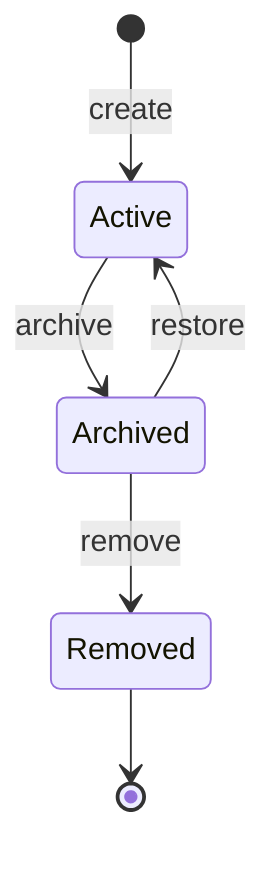
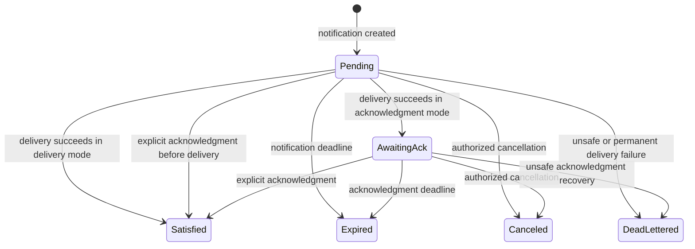

<!-- Snapshot from the terminal-multiplexers archive at its 2026-09 freeze
     (handoff 27, repo-consolidation Stage B). Authored here from now on.
     Relative links that do not resolve in this repo refer to the archive;
     cite it by tag, not branch. -->

# Duo vNext decision 04: collaboration domain

> Status: **locked by Session 4 on 2026-08-13.**
>
> Completion gate: **passed by contract walkthrough.** The implementation
> roadmap must repeat the walkthrough as a live stage gate.

## 1. Problem and boundary

Duo needs durable shared state that agents and humans can inspect, change, and
use for activation. Direct prompts and shared files do not supply one safe
model for attribution, concurrency, restart, and acknowledgment.

This decision defines collaboration objects, facts, current views, safe
mutations, subscriptions, notifications, and their lifecycle. It also selects
the minimum first vertical slice.

The collaboration domain reuses workspace, actor, fact, authorization,
command, and delivery foundations. It does not make a Duo session, runtime
instance, terminal, workspace, observation, or command into a collaboration
object.

This decision does not define wire schemas, CLI names, MCP tools, Go packages,
or storage technology. The Session 5 specifications own external spellings.
The Session 6 specifications own implementation sequence and live gates.

Tasks remain outside the initial substrate. Duo does not initially define task
status, assignment, dependencies, claims, workflow transitions, or task-graph
policy.

## 2. Prerequisites and evidence

The Session 1, Session 2, and Session 3 completion gates passed. This decision
uses their notes as normative specifications.

| Status | Input | Consequence |
|---|---|---|
| **Locked** | Session 1 gives each workspace and agent actor a durable Duo ID. It permits one live runtime binding per agent actor. | Collaboration objects use workspace placement and durable subjects. Notifications target an agent actor before they resolve an exact runtime instance. |
| **Locked** | Session 2 separates facts, observations, current views, revisions, and stream positions. Semantic streams use at-least-once delivery without a global sequence. | Collaboration facts are authoritative records. Object versions and stream resume positions remain separate. |
| **Locked** | Session 3 separates durable commands, prompt delivery, activity, and acknowledgment. It forbids automatic retry after an unknown-effect attempt. | A notification delivery record can create a prompt command, but neither record acknowledges collaboration content. |
| **Accepted** | The collaboration problem note proposed shared values, documents, inboxes, timers, subscriptions, facts, current views, and prompt-based activation. | Session 4 accepts the kinds with the narrower operations and boundaries in this note. |
| **Gap retained** | Solo prompt delivery and several host arbitration paths still need live conformance. | Collaboration delivery uses operation support. It never assumes that a named integration can deliver or acknowledge a notification. |

No Session 4 decision depends on a new claim about an external integration.
No live probe was necessary. The existing adapter gaps remain visible through
operation support and the Session 3 effect-certainty rules.

## 3. Accepted collaboration model

### 3.1 Collaboration-object kinds

The collaboration domain has five object kinds:

| Kind | Durable meaning | Current view |
|---|---|---|
| **shared value** | One scalar or structured value with guarded whole-value and object-path updates. | The current value, object version, relevant path tokens, and schema status. |
| **shared document** | One text document optimized for attributed append, with guarded whole-document correction. | The current text, document version, content format, and segment or correction metadata. |
| **inbox** | One ordered collection of immutable entries for one durable recipient actor. | Entries in authority acceptance order, with separate expiry and acknowledgment data. |
| **timer** | One durable, single-fire generation for a deadline or a stable observed condition. | Its definition, arm generation, evaluation state, last firing, and object version. |
| **subscription** | Durable policy that matches named facts and creates notifications for one target action. | Its matcher, target, lifetime, status, limits, last match, and object version. |

`Collaboration object` is the umbrella for these kinds only. Each kind keeps
its own safe operations. Duo does not expose one generic mutation verb.

A notification is a durable result of policy evaluation. It is not a sixth
collaboration-object kind. Inbox entries, notification delivery records,
prompt commands, command attempts, and acknowledgments also remain separate
records.

### 3.2 Shared supporting records

| Record | Meaning |
|---|---|
| **collaboration fact** | The authoritative accepted transition for one collaboration object or durable collaboration record. |
| **collaboration current view** | The materialized latest representation derived from retained collaboration facts. |
| **notification** | A durable obligation to inform or activate one target about named source facts. |
| **notification delivery record** | One scheduling of a notification or coalesced notification set through one prompt command. |
| **collaboration acknowledgment** | An explicit authenticated receipt for exactly one named notification or inbox entry. |

An audit record explains the request and policy decision. It does not replace
the collaboration fact. A stream item delivers a record. Duo can repeat the
stream item, but the item does not become the delivered record.

### 3.3 Minimum first vertical slice

The first vertical slice is one coherent accepted slice:

- Shared values with whole-value guards and object-member path guards.
- Shared documents with append and guarded whole-document correction.
- Durable inboxes with immutable post, read, entry expiry, and explicit
  acknowledgment.
- Exact-object fact subscriptions that target an agent actor.
- Durable notifications, prompt-command delivery, retry safety, coalescing,
  acknowledgment, dead letters, history, and restart recovery.

The slice includes all three data kinds because each closes a different
contract risk. Shared values prove nonoverlapping guarded concurrency. Shared
documents prove incremental multi-author work and human correction. Inboxes
prove durable recipient state and actor-level resume.

The following work is explicitly deferred from the first slice:

- Timer implementation. Session 4 accepts the semantic contract in Section 6.4.
  Timer implementation follows the first slice.
- Array-element concurrency, text patches, automatic text merges, CRDTs, and
  multi-object transactions.
- General locks, queues other than inboxes, counters, sets, binary blobs, and
  arbitrary user-defined object kinds.
- Subscription actions that mutate collaboration objects, call webhooks, or
  run local programs.
- Direct subscriptions to arbitrary observations or current-view expressions.
- Task objects, task graphs, workflow transitions, assignment policy, and a
  task-management interface.

## 4. Identity, placement, ownership, and lifecycle

### 4.1 Common object envelope

Every collaboration object has these semantic parts:

- An opaque Duo-issued collaboration-object ID and one fixed kind.
- One workspace placement. The workspace path is not part of the ID.
- One owning durable subject and one attributable creator.
- A lifecycle status, object version, creation time, and latest transition
  time.
- A current authorization policy reference and retention class.
- Optional mutable display metadata that never becomes identity.

An object cannot move between workspaces in the initial model. An authorized
caller can copy retained content into a new object in another workspace. The
copy records the source reference and gets a new ID and history.

Inbox entries, notifications, notification delivery records, facts, and
acknowledgments each receive their own Duo ID. A timer arm generation also has
a stable identity so that one generation can fire at most once.

Duo never reuses an object or owned-record ID. Removal retains a tombstone that
can explain a stale reference.

### 4.2 Ownership and authorship

A human actor, agent actor, or automation actor can own an object. A Duo
session and runtime instance cannot own one. Ownership can transfer only
through an authorized, guarded, audited transition in the same workspace.

Ownership does not replace authorization. Policy grants read, mutation,
archive, removal, ownership-transfer, subscription-management, activation,
and acknowledgment operations separately where their risk differs.

Every mutation records the authenticated author actor. An agent-authored fact
also records the bound Duo session and runtime instance as execution context.
Those runtime objects do not become the author.

A timer firing records Duo as the transition producer and the timer owner as
the policy principal. A subscription-created notification records the
subscription, its owner, the source facts, and the Duo authority incarnation.

### 4.3 Object lifecycle

An active object accepts its kind-specific mutations. An archived object is
read-only through ordinary operations. Its current view and retained history
remain inspectable. Restore uses an exact object-version guard.

Removal is terminal. It requires an archived object, a separate permission,
an exact object-version guard, and an audit reason. The tombstone retains the
ID, kind, workspace, final version, lifecycle times, and removal fact.

Retention policy can later purge sensitive payload content. Payload purge does
not remove the tombstone, fact identities, attribution metadata, causal links,
or audit evidence that policy requires. Policy cannot purge content that the
active current view needs. A purge is itself an accepted fact and makes any
affected archived history explicitly redacted.

Archive and removal do not acknowledge inbox entries or notifications.
Archiving a subscription stops new matches. Archiving a timer cancels its
current arm generation through a separate recorded transition.

## 5. Authoritative facts, current views, and concurrency

### 5.1 Facts are the authoritative logical store

Collaboration facts are the authoritative history for every collaboration
object and durable collaboration record. Neither can change without an
attributable fact that explains the change.

The authority commits these items in one local transaction:

1. The idempotency decision for the mutation request.
2. The accepted fact and per-object acceptance position.
3. The new object version and current view.
4. Any deterministic subscription-match identities created from that fact.

This rule does not require a specific event-sourcing framework. An
implementation can store materialized views and large content separately. The
fact remains normative when a derived view needs repair or rebuild.

Observations about external runtimes remain observations. A timer can evaluate
those observations through a current view. The timer firing becomes a domain
fact only when Duo accepts the firing transition.

Security audit records remain separate. A fact proves a domain transition. An
audit record proves the request, authorization, policy, and handling around
that transition.

### 5.2 Fact envelope and ordering

Each collaboration fact records:

- Its fact ID, target ID, target kind, fact kind, and resulting object version
  or record revision.
- The prior version, record revision, or kind-specific guard that the authority
  evaluated.
- The author, caller, workspace, acceptance time, and authority incarnation.
- The mutation payload or a retained content reference and digest.
- The caller idempotency scope and canonical request digest.
- Causal context, including root cause, direct cause, and subscription lineage.
- Kind-specific result data, such as an inbox-entry ID or changed value path.

Facts have a total Duo acceptance order within one collaboration object or
durable collaboration record. Duo makes no global ordering promise across
targets. Cross-target relationships use fact IDs and causal links instead of
sequence comparison.

The collaboration stream uses the Session 2 at-least-once contract. One object
or subscription scope has its own resume position. Fact IDs, object versions,
path tokens, and stream positions are not interchangeable.

### 5.3 Versions, guards, and idempotency

Each accepted semantic change increments the object's monotonic version once.
A duplicate request and a semantic no-op do not increment the version.

Each independently readable collaboration current view also has a view
revision. A fact-only view can change with its object version, but the tokens
remain distinct. A timer evaluation view can change when observation freshness
changes without a timer mutation. Write guards never use a view revision.

Every mutation uses caller-scoped idempotency. Its scope combines the caller,
operation, target object, and caller key. The same key and canonical request
return the first result. A different request under that key returns a conflict.

Idempotency records survive Duo restart. Their retention covers the longest
supported caller retry horizon and every dependent notification lifetime.

Whole-object mutations require the exact object version read by the caller.
Append and inbox post use kind-specific guards that permit safe concurrency.
Shared-value path operations use path tokens as defined in Section 6.1.

A failed guard returns `conflict` with the current object version and safe
re-read guidance. Duo never uses last-write-wins, arrival time, or author role
to resolve a write conflict. An authorization failure remains `unauthorized`
and does not leak the current value or version.

## 6. Kind-specific safe operations

### 6.1 Shared values

Safe shared-value operations are:

| Operation | Guard and effect |
|---|---|
| Create | Creates one scalar or structured value and version 1 under a caller idempotency key. |
| Read | Returns the current value, object version, and requested path tokens. It creates no fact. |
| Replace | Requires the exact object version and replaces the complete value. |
| Put object path | Requires the target path token or an explicit absent token and the containing-object generation. It creates or replaces one object member. |
| Remove object path | Requires the target path token and containing-object generation. It removes one object member. |
| Archive, restore, transfer, remove | Uses the common lifecycle or ownership guards. |

A path token represents the observed value or absence at one path. A
containing-object generation changes when a write replaces, removes, or
changes the type of that container. Adding or changing a sibling does not
change the containing-object generation.

Two path writes commute when neither path is equal to, an ancestor of, or a
descendant of the other. They can both succeed from one initial read. Duo
records their authority acceptance order and increments the object version for
each fact.

Overlapping writes conflict unless the later caller read the earlier path
token. An ancestor replacement conflicts with a guarded descendant write.
Arrays are atomic values at their selected path in the initial slice. Duo does
not offer concurrent array-index insertion or automatic structural merge.

Schema validation, when configured, runs before fact acceptance. A rejected
schema change creates an audit result but no collaboration fact.

### 6.2 Shared documents

Safe shared-document operations are:

| Operation | Guard and effect |
|---|---|
| Create | Creates the initial text, format, and version 1. |
| Read | Returns current text, version, and retained segment or correction metadata. |
| Append | Requires an active document and an idempotency key. It appends one immutable attributed segment in authority acceptance order. It does not require the prior document version. |
| Correct | Requires the exact document version and replaces the current text with one attributed revision and a correction reason. |
| Archive, restore, transfer, remove | Uses the common lifecycle or ownership guards. |

Concurrent appends all succeed when authorization and size limits pass. Their
order is Duo acceptance order. Duo does not claim that independent appends
have an external causal order.

A correction is a guarded whole-document revision. If an append wins the race,
the correction conflicts. The human or agent must read the new text and submit
a new correction. The prior text, append segments, authorship, and correction
facts remain in history.

The initial slice does not apply offsets or fuzzy text patches against a
changed document. It also does not merge competing corrections automatically.

### 6.3 Inboxes

An inbox names one immutable recipient agent actor. Its owner can be that actor
or another authorized durable subject.

Safe inbox operations are:

| Operation | Guard and effect |
|---|---|
| Create | Creates an inbox for one recipient actor. A separately authorized transaction can also create its initial subscription. |
| Post | Adds one immutable entry under an idempotency key. It requires an active inbox but no whole-inbox version guard. |
| Read or list | Returns visible entries and their separate acknowledgment and expiry data. It does not acknowledge them. |
| Acknowledge entry | Names one entry and recipient actor. It records one explicit acknowledgment fact or returns the existing fact idempotently. |
| Expire entry | Records that its absolute entry deadline passed. It does not delete or acknowledge the entry. |
| Archive, restore, transfer, remove | Uses the common lifecycle or ownership guards. |

Each entry has an inbox-entry ID, immutable author and recipient, content or a
durable object reference, acceptance position, optional expiry, and causal
context. An author corrects a message by posting a new linked entry. Duo does
not edit or retract the accepted entry in the initial slice.

Inbox insertion does not create a notification implicitly. An explicit inbox
subscription can match the entry-posted fact. A creation workflow can request
both objects, but each keeps a separate authorization decision and result.
The initial slice does not promise atomic multi-object creation.

Only an authenticated recipient actor or an explicitly granted delegate can
acknowledge an entry. A read, stream delivery, notification, prompt command,
terminal output, agent activity, or notification acknowledgment does not
acknowledge the inbox entry.

### 6.4 Timers

A timer has one active arm generation. It uses one of these accepted condition
forms:

- A fixed absolute deadline.
- All named Duo sessions hold one named condition for a continuous quiet
  period.
- Any named Duo session holds one named condition for a continuous quiet
  period.

Safe timer operations are create, arm, pause, resume, cancel, read, archive,
restore, and remove. Create and every definition change use an exact object
version. Arm creates a new generation. Pause, resume, and cancel name that
generation and use the current object version.

A condition timer records the exact Duo sessions, allowed condition, minimum
confidence, freshness requirement, and quiet duration. `All sessions idle`
therefore means that every selected session has a fresh qualifying `idle` view
continuously for the configured duration.

An `unknown`, stale, nonqualifying, replaced-runtime, or conflicting view
breaks the continuous interval. An authority outage also breaks the interval
unless retained source evidence proves the full interval. The safe recovery
default starts a new quiet interval.

One arm generation can produce at most one timer-fired fact. A restart can
record an overdue fixed deadline once. Firing changes durable timer state. It
does not deliver a prompt or acknowledge a notification. A subscription can
match the timer-fired fact and create a notification.

### 6.5 Subscriptions

Safe subscription operations are create, read, enable, pause, renew, archive,
restore, and remove. A definition or status change requires the exact object
version. Enabling also requires a future absolute expiry within configured
limits.

The initial matcher selects named collaboration-object IDs, named fact kinds,
optional shared-value path prefixes, and optional author or causal exclusions.
It can therefore match value changes, document appends, inbox posts, timer
firings, and lifecycle facts without a general expression language.

The initial target action creates a notification for one durable agent actor.
It does not mutate an object, insert an inbox entry, invoke a webhook, execute
a local process, or send terminal input.

## 7. Subscription evaluation and authorization

### 7.1 Match and creation transaction

For each accepted source fact, Duo evaluates active subscriptions that name the
source object. A match identity combines the subscription ID and version,
source fact ID, target actor, and target-action revision.

Duo creates at most one notification for one match identity. It stores the
match identity and notification in the same authority transaction that makes
the source fact visible. Recovery can repeat evaluation without creating a
second notification.

A subscription starts strictly after its creation barrier unless an explicit
authorized replay request names retained history. Enabling or renewing does
not silently replay earlier facts.

### 7.2 Target resolution

A subscription targets an agent actor, not a Duo session or runtime instance.
The notification can therefore survive sequential sessions and runtime
instances.

Before each delivery, Duo resolves the actor's one permitted live binding and
selects its exact runtime instance. The resulting prompt command binds to that
instance permanently. The command never follows the actor to a replacement
instance.

When a command had no effect before its target exited, the still-pending
notification can create a new delivery record for the actor's new runtime
instance. A delivered or unknown-effect command does not cause automatic
redelivery to the replacement.

When no valid live binding exists, the notification remains pending until its
expiry. Actor-binding conflict prevents delivery and appears in the
notification history.

### 7.3 Subscription lifetime and authorization

An enabled subscription has a required absolute expiry. Policy sets its
maximum renewable lifetime, pending-notification limit, rate limits, and
allowed target scope. Renewal is a guarded, audited mutation.

Subscription expiry or pause stops new matches. It does not cancel a
notification that the subscription already created. Each existing notification
continues under its own expiry, authorization, and delivery history.

Creation and enabling require all applicable permissions:

- Subscription management in the workspace.
- Read and subscribe access to every named source object.
- Activation authority for the target actor.
- Authority to request prompt delivery through the target's allowed policy.

Duo checks source visibility, target consent, activation policy, and prompt
authority again when it creates and delivers a notification. Revocation can
pause the subscription or dead-letter a notification. Duo never puts source
content in a prompt when the target cannot read that content.

An authorization failure during match handling never rolls back the accepted
source mutation. Duo records a suppressed match or a dead-letter notification,
as policy permits, and makes the failure inspectable.

The subscription owner and policy context authorize automated evaluation. A
later caller who only reads the source does not inherit the subscription's
activation authority.

## 8. Notification, delivery, and acknowledgment lifecycle

### 8.1 Notification record and states

Every notification records its ID, record revision, source fact IDs, origin,
target actor, creation time, and absolute expiry. It also records completion
mode, causal context, and authorization context.

The completion mode is either delivery or explicit notification
acknowledgment.

The notification state and delivery milestones are separate. A pending
notification can have several proved-no-effect delivery records. An awaiting
notification already has a delivered record and receives no automatic prompt
redelivery in the initial model.

Expiry stops delivery work. It does not expire, remove, or acknowledge the
referenced object, fact, document segment, or inbox entry. Cancellation has the
same content-preservation rule.

### 8.2 Notification delivery records and prompt commands

One notification delivery record resolves a target actor to one exact runtime
instance. It references exactly one prompt command. The prompt command then
uses its own responsibility states and command-attempt records.

The notification delivery record stores its own ID, notification IDs, target
actor, runtime instance, prompt-command ID, attempt policy, deadline, and
outcome. Its idempotency scope derives from the notification set, target
runtime instance, and delivery generation.

The prompt contains small durable references and notification IDs. It does not
copy protected collaboration content by default. The target reads content
through collaboration-read authorization.

Prompt-command acceptance, queueing, attempting, delivery, activity, and
acknowledgment keep the Session 3 meanings. None inserts an inbox entry or
acknowledges a collaboration record.

### 8.3 Retry and restart

Duo retries notification delivery only when all these conditions hold:

- The notification remains pending and unexpired.
- The target actor has one valid live binding and all permissions still pass.
- The prior prompt command had no attempt or proved `no effect`.
- The bounded notification attempt count and backoff permit another delivery.
- The human-priority gate can release one prompt at one ready boundary.

An unknown-effect prompt command makes automatic notification redelivery
unsafe. Duo dead-letters the notification with the linked `indeterminate`
result unless the adapter reconciles the same external attempt.

A delivered prompt receives no automatic redelivery. This rule applies even
when the notification still awaits explicit acknowledgment. An authorized
operator can create a new linked notification after reviewing the history and
risk.

After a Duo restart, Duo reloads notifications, delivery records, prompt
commands, deadlines, attempt counts, actor bindings, and causal limits. It
reuses match and idempotency identities. It does not infer that an in-progress
attempt had no effect.

### 8.4 Acknowledgment

Notification acknowledgment is an explicit authenticated operation that names
the notification ID and target actor. Inbox-entry acknowledgment is a separate
operation that names the inbox-entry ID and recipient actor.

A prompt-command receipt acknowledges only the command unless the target
protocol explicitly names the notification ID and declares notification
acknowledgment semantics. Even then, it does not acknowledge a referenced
inbox entry.

One external request can later ask for both acknowledgments. Duo must evaluate
both permissions and record two distinct facts. The initial slice does not
need a compound operation.

Acknowledgment means receipt and acceptance of responsibility for the named
record. It does not mean that a task succeeded, a document is correct, or an
agent completed work.

### 8.5 Coalescing and dead letters

Duo can coalesce pending notifications into one prompt command when they have
the same target actor, runtime instance, authorization boundary, ready
boundary, and compatible expiry. The prompt lists every notification ID and
durable reference.

Coalescing changes delivery efficiency only. It does not merge notifications,
facts, inbox entries, acknowledgments, deadlines, or causal histories. Each
notification reaches its own result from the shared delivery record.

Policy bounds the number of references and prompt bytes in one batch. An
earlier expiry limits the shared attempt. Notifications that do not fit remain
pending for later ready boundaries.

Duo dead-letters a notification when a permanent authorization or target
failure prevents delivery. Duo does the same when retry limits end, effect is
indeterminate, or storm policy forbids further action. A dead letter retains
source references, delivery history, and a safe reason.

Dead-letter review is a separate authorized operation. Requeue creates a new
notification linked to the dead letter. It never reopens a terminal record or
silently reuses an unsafe prompt command.

## 9. Causal context, loops, and storm limits

Every fact, notification, delivery record, and prompt command carries a causal
root ID and direct parent ID when known. Agent-facing activation also supplies
the subscription ID and notification IDs so that a later mutation can preserve
the lineage.

The initial loop rule is strict. When a source fact's retained causal ancestry
already contains the matching subscription ID and subscription version, Duo
suppresses the match. Duo records the suppression in subscription history and
does not create a notification.

The suppression applies to one causal chain. It does not suppress a later
independent update merely because the update concerns the same object and
subscription.

Generated harness projections should preserve the received cause token on
responsive collaboration mutations. When a caller omits causal context, Duo
cannot invent it. Rate, depth, and pending-work limits still contain the
result.

Duo enforces these configured limits:

- Maximum notifications per source fact and causal root.
- Maximum causal depth and subscription fan-out.
- Per-subscription and per-target notification rates.
- Maximum pending notifications, retained delivery records, and activation
  bytes.
- Bounded delivery attempts, backoff, and absolute notification lifetime.

Crossing a hard causal or fan-out limit suppresses new matches and records the
reason. Repeated rate or pending-work violations pause the subscription. A
notification that can no longer proceed becomes a dead letter.

Initial subscription actions only notify an actor. They cannot directly write
another collaboration object. This boundary removes a large class of
unattended mutation loops.

## 10. Required scenario walkthroughs

### 10.1 Two agents update different shared-value paths

Agents A and B read one value at version 4. Agent A reads the token for
`checks.linux`. Agent B reads the token for `checks.macos`. Both also read the
same containing-object generation.

Agent A changes `checks.linux`. Duo accepts version 5. The sibling update does
not change Agent B's path token or containing-object generation, so Duo accepts
Agent B's update as version 6. History shows both authors and acceptance order.

If either agent replaces `checks`, the replacement changes the container
generation. The other guarded path update conflicts and must re-read.

### 10.2 Agents append findings while a human corrects the document

Several agents append findings concurrently. Each append becomes one
attributed segment and fact. Duo orders them by acceptance without rewriting
the other segments.

The human reads document version 12 and submits a correction for version 12.
If no append wins first, the correction becomes version 13. If an append
becomes version 13 first, the correction conflicts. The human reads the new
document and submits a deliberate corrected revision.

No fuzzy patch lands on unexpected text. Every prior segment and correction
remains inspectable.

### 10.3 An inbox entry survives delivery failure and Duo restart

Agent A posts entry E to Agent B's inbox. The entry-posted fact commits before
subscription evaluation creates notification N. N creates delivery record D
and prompt command C for B's current runtime instance.

The adapter disconnects after a possible write. C fails with unknown effect.
D records the result, and N becomes dead-lettered. E remains unacknowledged in
the inbox.

Duo restarts and reloads E, N, D, C, their idempotency records, and history. It
does not resend C or acknowledge E. An authorized reviewer can create a new
linked notification after reviewing the indeterminate risk.

### 10.4 A quiet-period timer activates an orchestrator

Timer T names selected Duo sessions, condition `idle`, fresh reported or
accepted inferred evidence, and a five-minute quiet period. Any non-idle,
stale, unknown, conflicting, or replacement-runtime view resets the interval.

When all selected sessions remain qualified for five continuous minutes, Duo
records one timer-fired fact for T's arm generation. Subscription S matches
that fact and creates a notification for orchestrator actor O.

The notification resolves O's current runtime instance and uses the normal
prompt gate. Timer firing, notification creation, prompt delivery, and
acknowledgment remain four separate transitions.

### 10.5 A subscription sees its own resulting update

Subscription S matches changes to one shared-value path and notifies Agent A.
Agent A follows the activation and writes a new matching value with N as its
cause.

The new fact's ancestry contains S and its version. Duo records a suppressed
match and creates no second notification. A later independent human write has
no S ancestry and can match normally.

### 10.6 An agent actor resumes with unacknowledged inbox entries

Agent B's old runtime instance exits. Its inbox and unacknowledged entries
belong to durable actor B, not to the session or process.

B resumes through a new runtime instance under the Session 1 binding rules.
The new instance reads the same entries. A pending notification with a proved
no-effect prior delivery can resolve the new instance and create a new prompt
command. A delivered or unknown-effect command does not resend automatically.

B explicitly acknowledges each inbox entry. The facts record actor B and the
new runtime context without changing the original entries.

### 10.7 A caller has collaboration-read but no prompt permission

The caller can read each authorized object, current view, and retained history.
The caller cannot create or enable an activating subscription, manually notify
an actor, retry a dead letter, release a queued prompt, or submit prompt
delivery.

An existing subscription can still run under its own owner and policy context.
Its authority does not transfer to the read-only caller. A read never inserts
an inbox entry, creates a notification, or acknowledges content.

## 11. Completion-gate flow

One walkthrough combines the accepted slice across two agents and one human:

1. Human H creates shared value V, findings document D, Agent B's inbox I, and
   exact-object subscriptions under workspace W.
2. Agent A updates `checks.linux` in V. Agent B concurrently updates
   `checks.macos`. Both guarded path writes succeed and retain attribution.
3. V's accepted facts create deduplicated notifications. Duo coalesces their
   delivery references into one prompt command for B without merging them.
4. Agent B reads V, appends a review finding to D, and explicitly acknowledges
   the notifications.
5. Agent A posts inbox entry E for B. E remains durable while its first
   notification delivery proves no effect and Duo restarts.
6. B resumes in a new runtime instance. The pending notification resolves the
   new instance, passes the human-priority gate, and creates a new exact-target
   prompt command.
7. B reads and acknowledges E. Prompt delivery itself did not acknowledge E.
8. H reads the complete attributed history and corrects D with its exact
   document version. A racing append would return a visible conflict.

The flow is durable because facts, entries, notifications, commands, and
idempotency survive restart. It is inspectable and attributable through one
history. It is incremental through path writes and document appends. It is
reactive through fact subscriptions and guarded prompt activation.

No step turns W, a Duo session, a runtime instance, or a terminal into a
collaboration object.

## 12. Rejected alternatives

| Alternative | Reason rejected |
|---|---|
| Make every Duo object a generic collaboration resource. | Sessions, terminals, commands, observations, and collaboration data have different identity, lifecycle, authority, and safe operations. |
| Use current views as the only durable store. | A current value cannot explain authorship, conflict, causal lineage, restart recovery, or notification creation. |
| Use facts only for audit after mutable state changes. | A crash could separate the accepted transition from its history and reactive consequences. Facts are the authoritative logical transition. |
| Give every kind one generic `set`, `patch`, or `delete` operation. | Values, documents, inboxes, timers, and subscriptions need different safe concurrency rules. |
| Use last-write-wins for value paths or document corrections. | Arrival order would silently discard an accepted collaborator's intent. |
| Require one object-version guard for every document append and inbox post. | Safe independent appends and posts would conflict without protecting an overwritten value. |
| Add a general lock primitive to solve concurrency. | Guarded kind-specific operations cover the initial cases without lock expiry, ownership, and deadlock policy. |
| Treat inbox post as prompt delivery. | Durable insertion, activation, transport outcome, receipt, and acknowledgment are different facts. |
| Redeliver every unacknowledged notification after restart. | A delivered or unknown-effect prompt can make redelivery duplicate an agent turn. |
| Let a read-only caller trigger an existing subscription manually. | Read access must not grant indirect prompt or code-execution authority. |
| Let subscriptions mutate objects directly. | Direct actions create unattended write loops and introduce workflow policy before the substrate is proven. |
| Model tasks in the first slice. | Task status, assignment, dependencies, and workflow transitions need a typed product and human interface. |

## 13. Consequences and remaining triggers

Duo needs durable local transactions across facts, views, idempotency, and
subscription matches. It also needs retained causal context and conservative
recovery for prompt effects.

The Session 5 specifications define public schemas for guarded paths, versions,
idempotency, pagination, history, notifications, delivery records,
acknowledgments, errors, and authorized content references.

The Session 6 architecture preserves the logical atomicity in Section 5. The
roadmap tests configured limits for object size, fact retention, fan-out,
causal depth, notification bytes, pending work, attempt count, backoff, and
expiry.

These triggers remain after the first slice:

- Add timers when the first-slice fact and notification recovery tests pass.
- Add text patches or merge only when real correction workloads show that
  guarded whole-document revision is insufficient.
- Add array-element concurrency only with stable element identity and tested
  overlap rules.
- Add another subscription target only after its authorization, idempotency,
  effect certainty, and dead-letter behavior match this model.
- Add a task product only when Duo has explicit task semantics and a human
  interface. Implement it as a typed product over the substrate.
- Revisit multi-authority synchronization only when the locked local-authority
  boundary changes.

No external integration evidence gap changes the object or concurrency model.
An unconformed delivery path reduces prompt support and can leave a
notification pending or dead-lettered.

## 14. Session 5 accepted inputs

Session 5 preserves these accepted object rules:

- The collaboration-object kind set contains shared value, shared document,
  inbox, timer, and subscription.
- Every object has an opaque Duo ID, one workspace placement, one durable
  owner, attributable authors, a monotonic version, and active, archived, or
  removed lifecycle.
- Collaboration facts are authoritative. Current views, audit records, stream
  items, notifications, inbox entries, and delivery records remain distinct.
- The first vertical slice contains shared values, shared documents, inboxes,
  exact-object subscriptions, notifications, delivery, and acknowledgment.
  Timers follow as the next accepted kind.

Session 5 preserves these concurrency rules:

- Every mutation is idempotent within caller, operation, target, and key scope.
- Whole-object writes use exact object versions.
- Nonoverlapping object-member path writes can both succeed with path and
  container guards. Overlapping writes conflict. Arrays remain atomic.
- Document appends and inbox posts accept safe concurrency in authority order.
  Document corrections use an exact version. Inbox entries are immutable.

Session 5 preserves these subscription rules:

- Initial subscriptions match named object facts and create notifications for
  one agent actor. They do not mutate objects or run arbitrary actions.
- Enabled subscriptions have finite renewable lifetimes, dynamic
  authorization checks, stable match identities, and causal-loop limits.
- Timer conditions create timer-fired facts. Subscriptions match those facts.

Session 5 preserves these delivery rules:

- A notification, notification delivery record, prompt command, command
  attempt, inbox entry, and acknowledgment have separate identities and
  states.
- Actor-targeted notifications resolve one exact runtime instance per delivery
  record. The prompt command never follows a replacement instance.
- Automatic retry requires proved no effect or reconciliation. Delivered and
  unknown-effect commands do not cause automatic notification redelivery.
- Coalescing merges only prompt references. It never merges durable records or
  acknowledgment obligations.
- Expiry and dead-letter transitions preserve source content and inspectable
  history. Requeue creates a new linked notification.

## 15. Session 6 live stage gate

The implementation roadmap must repeat the Section 11 flow with durable
storage and real prompt delivery. The live gate must cover these cases:

- Two agent actors and one human actor use the same workspace objects.
- Two nonoverlapping value-path writes succeed from one initial read.
- Concurrent document appends remain attributed, and a stale correction
  conflicts.
- An inbox entry and pending notification survive an authority restart.
- A resumed agent actor reads and explicitly acknowledges the original entry.
- One proved-no-effect delivery retries safely. One unknown-effect delivery
  does not retry and becomes inspectable dead-letter work.
- Duo suppresses one causal self-reaction and enforces the fan-out limits.
- The flow uses at least two materially different host and runtime
  compositions without integration-name branches in the client.

The gate must run before public schema freeze or initial release readiness.

## 16. Completion-gate assessment

**Passed by contract walkthrough.** Section 11 shows one durable, inspectable,
attributable, incremental, and reactive flow across two agents and one human.
The flow reuses workspace and actor identity, authoritative facts, guarded
views, dynamic authorization, prompt commands, effect certainty, and semantic
stream rules.

The flow keeps Duo sessions and terminals outside the collaboration-object
model. It also keeps notification creation, inbox insertion, prompt delivery,
and explicit acknowledgment separate. Section 15 makes the same flow a
mandatory live implementation stage gate.

The timer scenario also passes by contract walkthrough. Timer implementation
is explicitly deferred until the first-slice recovery contract passes. Task
graphs and workflow policy remain a later typed product over the substrate.

## 17. Amendments

**2026-08-14 (review follow-up, G-02: notification prompt caller).** A
notification-created prompt command records the Duo notification-delivery
authority as its authenticated caller. The subscription owner appears as
the policy principal, and the notification delivery record appears as the
originating component. The command's caller idempotency key derives from
the Section 8.2 delivery-record identity: the notification set, target
runtime instance, and delivery generation. Audit therefore attributes
automated activation to Duo acting under the owner's authority. It never
attributes the prompt to the target actor or to a human caller.

**2026-08-14 (review follow-up, G-08: timer evidence-sufficiency arm
gate).** A condition timer arms only when each selected Duo session has a
conformed source with sustained readability for the allowed condition. The
source must meet or exceed the timer's minimum confidence. Sustained
readability means the
conformance record declares a level-read method (a re-observable current
value), a maximum poll interval, and a validity window not shorter than
that interval. Edge sources that fire once per transition satisfy
transition observation but never satisfy this gate. When no such source
exists, Duo rejects the arm with a stable evidence-insufficiency error
that names the strongest sustainable confidence. A timer never arms into
a state where it cannot legally fire. This gate adds the liveness half to
the Section 6.4 contract. The recovery rule stands unchanged.

**2026-08-14 (review follow-up, G-14: absent-token wire encoding).** The
Section 6.1 "explicit absent token" is an ordinary opaque path token. A
read issues one token per requested path. The token asserts the observed
value for a present path and the observed absence for an absent path.
Put-if-absent therefore sends the absence token in the same `path_token`
field, with no sentinel value and no separate wire field. Every path
write requires `path_token`. An omitted token is `invalid.precondition`,
never an unguarded write. This closes the ambiguity with the public
contract's omit-when-absent field rule: the field is never legally absent
on a path write.

**2026-08-14 (review follow-up, G-15: permission granularity).** The
Section 4.3 "separate permission" for removal is now a distinct grant:
`collaboration.remove`, split from `collaboration.lifecycle`, which keeps
archive and restore. For Section 8.4, the two acknowledgment operations
share the one `collaboration.acknowledge` permission name. "Evaluate both
permissions" means two authorization decisions, one per named target in
its own scope, and two distinct facts. It does not require two permission
names. The access-and-errors specification records both rules.
