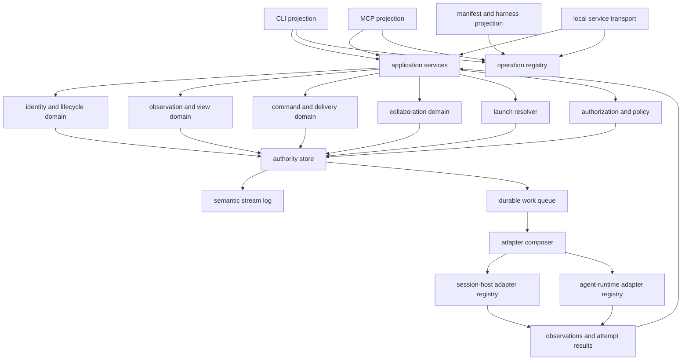

<!-- Snapshot from the terminal-multiplexers archive at its 2026-09 freeze
     (handoff 27, repo-consolidation Stage B). Authored here from now on.
     Relative links that do not resolve in this repo refer to the archive;
     cite it by tag, not branch. -->

# Duo vNext Go architecture and adapter contract

> Status: **normative implementation contract from Session 6.**

## 1. Scope

This specification defines the Go component boundaries, durable transaction
boundaries, adapter roles, launch resolution, operation path selection, and
local service boundary for Duo vNext. The public meanings remain normative in
the Session 1 through Session 5 decision set.

The architecture has these invariants:

- One local Duo authority is the only writer of Duo identities, facts,
  commands, policy decisions, and normalized views.
- Public operations enter one application path. CLI, MCP, and presentation
  code do not call adapters directly.
- A session-host adapter and an agent-runtime adapter have different
  contracts. Neither contract embeds the other.
- An external call never occurs while a durable database transaction is open.
- A recorded external effect never becomes a fact, acknowledgment, or stronger
  delivery claim than its conformance record permits.
- A future Duo session can have no session-host adapter and no terminal.

## 2. Component map



The first product uses one `duo` binary. The binary is the composition root for
the authority, CLI, local Unix-socket service, manifest, installation commands,
and adapter workers. A later process split can preserve these contracts.

## 3. Go component responsibilities

| Component | Owns | Must not own |
|---|---|---|
| Domain kernel | Identity, lifecycle, observation ranking, commands, collaboration facts, guards, and state transitions. | Adapter protocols, SQL, JSON, CLI flags, or HTTP. |
| Application services | Operation orchestration, transaction selection, authorization, idempotency, and result assembly. | Surface-specific meanings or direct transport parsing. |
| Launch materialization (2026-08-24 handoff 22 amendment) | Resolving the workspace root and deducing the one session-host instance for a launch (explicit flag > workspace↔host correlation > ambient environment > policy default), snapshotting the standing provider facts, and assembling the immutable evidence bundle it hands to the launch resolver. It runs in the CLI layer before resolution step 1, and it is the only component that reads the ambient environment. (2026-08-26 handoff 24 amendment: the living ranking inserts cwd-correlation between workspace↔host correlation and ambient environment. See notes/51 record 6.) | Candidate narrowing, assignment search, the launch-resolution record, socket reachability checks, or any further read of the environment, the database, or the filesystem after the bundle is sealed. |
| Launch resolver | Preset materialization, require/avoid narrowing, bounded complete-assignment search, avoid-relent, and the durable launch-resolution record. It finishes before any `HostLauncher.PrepareLaunch` call. | Live reachability, selected or effective configuration, adapter method dispatch, or public operation names. |
| Authority store | Durable records, indexes, migrations, transactional compare-and-change, stream positions, and durable work claims. | Semantic policy decisions that belong to the domain. |
| View projectors | Current views and support views derived from retained facts and observations. | External effects. |
| Semantic stream log | Stable item IDs, ordering by declared scope, barriers, retention, and cursor expiry. | Terminal paint or a global sequence promise. |
| Durable work queue | Pending adapter attempts, observation polling, notification delivery, and retry scheduling. | Automatic retry of an unknown effect. |
| Adapter composer | Compatibility checks, candidate collection, support calculation, path selection, and diagnostics. | Public operation names or authorization grants. |
| Session-host registry | Typed host factories and host conformance records. | Agent transcript parsing or agent identity authority. |
| Agent-runtime registry | Typed runtime factories, parsers, reporters, and runtime conformance records. | Host-container identity or terminal ownership. |
| Projections | Decode and encode the accepted operation registry for CLI, MCP, and local service transports. | Independent validation, policy, or retry behavior. |
| Manifest and installer | Static capability metadata, assets, renderers, stamps, and drift checks. | Live operation support. |

These responsibilities can become Go packages after the first dependency
tests pass. Package names are not part of this specification.

**2026-08-24 handoff 22 amendment (`duo.config/v3` late-bound session hosts;
ratified in `notes/43-config-v3-change-control.md`, records 3, 6, and 7).** The
domain kernel gains two standing fact families, and both reach launch
resolution only through the materialized evidence bundle.

- The workspace↔host-instance correlation is carried by
  `workspace.host_bound` (the first bind or an explicit bind, recording the
  `host_source` provenance and the notes/19 §5 fingerprint set) and
  `workspace.host_rebound` (an audited change, recording the old and the new
  instance with their fingerprints). They are the host siblings of the existing
  workspace path-rebind fact and obey the correlation rules already stated in
  §4.2: the correlation is rebindable current state, never an identity, and it
  routes new spawns only.
- Provider availability is carried by `provider.disabled` and
  `provider.enabled`, with default enabled unless a standing disable fact says
  otherwise. Provider state is installed policy for the resolver's hard static
  eliminations. It is not a configuration block, and a provider exists by being
  named on a launch variant.

Both families are written only by their audited verbs
(`duo workspace host rebind`, `duo provider disable|enable`). Materialization
reads them once, by fact ID, and the resolver never reads them again.

The launch-eligibility Support oracle keys conformance evidence on (host kind,
host version, runtime kind) (2026-08-24 handoff 22 amendment; notes/43 record
7). A config-named host instance is no longer an evidence key. Hosts are
late-bound, so no config-named instance survives to key on, and the earlier
keying gave one server two evidence keys whenever two config names pointed at
it. Conformance is a property of a host kind at a version composed with a
runtime kind. The version source and the match semantics belong to the
conformance-record contract and stay parked as notes/43 thread 5.

## 4. Authority storage and effects

### 4.1 Store choice

The initial authority store is one local SQLite database in WAL mode. The Go
driver must support transaction cancellation and must not require a separately
managed database server. Startup enables foreign-key checks, sets a bounded
busy timeout, verifies the schema version, and acquires one authority-writer
lease.

SQLite is an implementation choice, not a public contract. Repository
interfaces accept domain records and compare-and-change requests. They do not
expose SQL rows to the domain or projections.

### 4.2 Required atomic boundaries

One transaction commits each of these logical changes:

- Workspace or session enrollment, correlations, runtime instance, and the
  active live-runtime claim.
- Command acceptance, caller idempotency, initial responsibility state, audit
  link, and durable work item.
- One command transition and its attempt or reconciliation metadata.
- One accepted observation, any affected current-view revisions, and semantic
  stream items.
- One collaboration mutation, idempotency decision, fact, object version,
  current view, and deterministic subscription-match identities.
- One notification or acknowledgment transition and its causal links.
- One projection-install ownership change before filesystem placement reports
  success.
- One successful launch resolution, its launch-resolution record, and the
  session and runtime-instance links that the record may later gain. A failed
  resolution commits no session and no launch-resolution record.

Large content can use content-addressed files beside SQLite. The transaction
commits the digest and a prepared content reference only after the file has
been durably placed. Garbage collection removes only unreferenced prepared
content after a safe age.

### 4.3 External-effect protocol

The authority uses a durable prepare, attempt, reconcile sequence:

1. Commit the accepted command and a pending work item.
2. Claim the work item with a lease and create the attempt before an external
   call.
3. Close the database transaction.
4. Call exactly one selected adapter path.
5. Commit the result, effect certainty, stream item, and next work decision.
6. On restart, reconcile the attempt before any retry.

An expired lease does not prove no effect. The next worker retries only when
the conformance record and retained external attempt identity prove no effect
or permit idempotent reconciliation.

An attempt record with no recorded result does not distinguish a crash
before the call from a crash during the call. Absence of the attempt record
is the only generic no-effect proof. Reconciliation exists only where the
conformance record defines an external attempt token or a result lookup.
Otherwise recovery marks the attempt `unknown_effect` and fails the command
as `indeterminate`.

## 5. Adapter contracts

### 5.1 Shared adapter envelope

Every adapter factory declares an adapter ID, role, build version, supported
external-version rules, conformance-record digest, and diagnostic redaction
policy. The factory probes an integration instance before it creates an active
adapter.

A probe returns detected version, protocol or format identity, connection
state, fixture or schema digest when available, and one compatibility state:
`supported`, `unverified`, `incompatible`, or `unavailable`. A probe does not
publish live Duo operation support by itself.

Capability-specific interfaces return typed path candidates. Duo does not use
one broad `Backend` interface or boolean capability bag.

### 5.2 Session-host contract

A launch resolver completes launch resolution and records the
launch-resolution record before any `HostLauncher.PrepareLaunch` call
(2026-08-18 handoff 18 amendment). `PrepareLaunch` receives the already-resolved
launch tuple. Resolution failure never calls `PrepareLaunch`. Validation sets
finite maxima for leaves, candidates per leaf, and assignment product.
Exceeding a maximum is a declaration error. The resolver never truncates
search.

A session-host adapter can implement these independent interfaces:

```go
type HostDiscovery interface {
    Discover(context.Context, DiscoveryRequest) ([]HostCandidate, error)
}

type HostLauncher interface {
    PrepareLaunch(context.Context, HostLaunchRequest) (PreparedHostLaunch, error)
    Start(context.Context, PreparedHostLaunch) (HostLaunchEvidence, error)
}

type HostAttachmentValidator interface {
    ValidateAttachment(context.Context, HostAttachmentClaim) (HostContinuityEvidence, error)
}

type HostLifecycleSource interface {
    ObserveHostLifecycle(context.Context, HostObservationRequest) (HostObservationStream, error)
}

type HostTerminalProvider interface {
    TerminalReadPath(context.Context, HostAttachment) (TerminalReadCandidate, error)
    TerminalInputPath(context.Context, HostAttachment) (TerminalInputCandidate, error)
}

type HostPromptProvider interface {
    PromptPath(context.Context, HostAttachment) (PromptPathCandidate, error)
}
```

Host evidence uses host-server epochs, host-container IDs, and process-birth
evidence. A pane ID or PID alone cannot prove runtime continuity. A host prompt
path supplies a semantic attempt result. It never changes host evidence into an
agent acknowledgment.

(2026-08-26 handoff 25 amendment: the delegation-loop milestone brings
`HostPromptProvider` into implementation scope as an adapter interface.
Public projection is CLI only (`prompt.deliver`, `command.inspect`). MCP
and presentation routes stay named and out of this milestone.
Command-result streams stay named and unwired.)

(2026-08-26 handoff 26 amendment: the post-launch identity-bind
milestone uses `Authority.Bind` with `launch-plan` attestation as the
late-SessionStart path after spawn, then `MarkLive`. Host-reported
pane `agent_session` is evidence on the claim, not a fourth
`BindingSource`. See
[`handoffs/26-launch-bind-scope.md`](./handoffs/26-launch-bind-scope.md).)

### 5.3 Agent-runtime contract

An agent-runtime adapter can implement these independent interfaces:

```go
type RuntimeCorrelator interface {
    Correlate(context.Context, RuntimeClaim) (RuntimeCorrelationEvidence, error)
}

type ConversationProvider interface {
    ReadConversation(context.Context, ConversationReadRequest) (ConversationBatch, error)
}

type ConditionProvider interface {
    ObserveCondition(context.Context, ConditionObservationRequest) (ConditionObservationStream, error)
}

type RuntimePromptProvider interface {
    PromptPath(context.Context, RuntimeBinding) (PromptPathCandidate, error)
}

type UsageProvider interface {
    ReadUsage(context.Context, UsageReadRequest) (UsageObservation, error)
}

type RuntimeConfigurationProvider interface {
    ReadRuntimeConfiguration(context.Context, RuntimeConfigurationReadRequest) (RuntimeConfigurationObservation, error)
}

type HarnessRenderer interface {
    Render(context.Context, HarnessRenderRequest) (RenderedProjection, error)
}
```

Runtime evidence keeps the external agent-session and transcript identifiers
as scoped correlations. A transcript path or working directory cannot bind a
runtime instance. Generated hooks receive a reporter credential for one exact
runtime instance.

(2026-08-26 handoff 25 amendment: the delegation-loop milestone brings
`ConditionProvider` and `RuntimePromptProvider` into implementation
scope as adapter interfaces. Public projection is CLI only:
`session.inspect` condition, `conversation.list`, `prompt.deliver`, and
`command.inspect`. MCP and presentation routes stay named and out of
this milestone. Condition and command-result streams stay named and
unwired. `RuntimeConfigurationProvider` stays out of this milestone.
`HarnessRenderer` (the Stage 5 renderer) stays named and out of this
milestone. See
[`handoffs/25-delegation-loop-scope.md`](./handoffs/25-delegation-loop-scope.md).)

(2026-08-26 handoff 26 amendment: the post-launch identity-bind
milestone does not add adapter interfaces. It writes the
`agent.session` / `transcript` correlations those interfaces already
read, then `MarkLive`. Claude's messaging socket becomes reachable
once the external session id is bound. See
[`handoffs/26-launch-bind-scope.md`](./handoffs/26-launch-bind-scope.md).)

`RuntimeConfigurationProvider` returns the selected-configuration observation
for one runtime instance and the effective-configuration record for one source
turn (2026-08-17 handoff 16 amendment). It also returns the selected and
effective working mode for the same scope (2026-08-17 handoff 17 amendment).
The selected observation commits as an accepted observation that updates the
facet's current views and their stream revisions. The effective records are
immutable and dedupe by source-record identity. A runtime with no configuration
or working-mode source degrades the facet explicitly instead of fabricating a
value. Working mode and model identity stay separate namespaces even though
they share one provider envelope.

### 5.4 Role separation tests

Architecture tests must prove these dependency rules:

- Host adapters compile without importing an agent-runtime adapter package.
- Runtime adapters compile without importing a host adapter package.
- The composer depends on the two registries through separate interfaces.
- Domain and application tests can use fake host and fake runtime registries
  independently.
- A session with a fake runtime adapter and no host adapter can reach a valid
  nonterminal lifecycle state.

## 6. Operation path selection

Launch resolution chooses declared launch candidates before spawn. This
section is the Adapter composer's per-operation choice among typed,
conformance-qualified host and runtime adapter paths for an exact target
(2026-08-18 handoff 18 amendment). It is not config composition and does not
resolve `presets` or `compositions`.

For each semantic operation, the composer performs these steps:

1. Load the exact session, runtime instance, attachment, and adapter probe
   revisions.
2. Collect typed candidates from the host and runtime registries.
3. Remove candidates with incompatible versions, failed conformance, stale
   target evidence, missing permissions, or unmet semantic preconditions.
4. Apply the caller's minimum quality and allowed realization without
   weakening either value.
5. Rank remaining candidates by semantic contract coverage, effect certainty,
   current availability, freshness, and configured operator preference.
6. Select one candidate with a deterministic tie break and record the decision.
7. Publish a revised support view when availability, quality, realization,
   constraints, or selected source changes.

Adapter names can appear in privileged diagnostics and attempt records. They
cannot change the public operation, result state, error class, permission, or
client behavior.

The selection record includes all candidate rejection reasons, the selected
conformance digest, probe revision, policy revision, target evidence, and
fallback eligibility. A failed selected path does not fall through after a
possible effect. Duo returns the correct failure and reconciles it first.

## 7. Protocol-owned integration seam

A future protocol-owned integration is a third integration role. It is not a
session-host adapter and not a distinct public Duo-session species. It can
create a runtime instance with no host attachment and can supply conversation,
condition, command, usage, permission-request, and lifecycle paths.

The role differs from an attached agent-runtime adapter in these ways:

- Duo starts and supervises the protocol process.
- Process mortality normally follows the protocol client unless the protocol
  proves a durable resume mechanism.
- Duo must answer typed permission requests under explicit grants and audit.
- Duo must implement or explicitly decline each client-side file service the
  protocol offers, such as ACP `fs/read_text_file` and `fs/write_text_file`
  (2026-08-14 review amendment, G-22). An implemented file service serves
  plain disk reads and writes under workspace grants and audit. Duo has no
  editor buffers to serve. Declining the capability is legal, and the
  conformance record states the choice.
- A protocol session has no terminal unless the protocol requests terminal
  service and Duo supplies a separately authorized terminal provider.
- Disconnect can be process death, protocol loss, or a recoverable session.
  The conformance record must distinguish them.

The public identity, runtime-instance finality, command, collaboration, and
error contracts do not change for this role.

Adapter-trailing caveat (2026-08-14 review amendment, G-22): for the major
attached runtimes, an ACP wrapper trails the vendor surface. For Claude Code
and Codex, a wrapper is worse than the native attach or vendor path. When an
attach adapter for those runtimes breaks, repair it or move to the vendor
surface. A wrapper does not satisfy the protocol-owned trigger. The
protocol-owned role targets natively protocol-owned agents.

## 8. Local service and projection boundary

The local service implements the accepted HTTP, SSE, and terminal transports
over a Unix socket. The service authenticates the local peer, resolves an
enrolled subject, decodes one canonical operation, calls the application
service, and encodes the common envelope.

CLI and MCP projections use the same generated request and result codecs where
practical. A conformance test decodes all three projections to an equal domain
value. Hand-written surface code must pass the same comparison.

The binary contains the operation registry. The manifest, CLI metadata,
MCP tool schemas, presentation route metadata, audit requirements, and schema
fixture inventory derive from that registry. Runtime support remains outside
the static manifest.

## 9. Failure containment and diagnostics

Each integration instance has a bounded worker group, queue, deadlines,
backoff, and circuit state. A panic or malformed external payload stops that
integration worker. It does not stop the authority. Repeated parse or protocol
failures change affected support views to temporarily unavailable or
unsupported.

Semantic stream buffers, terminal buffers, and adapter input buffers have
separate limits. Duo disconnects a slow semantic client before it drops an
ordered item. A slow terminal client receives a replacement snapshot. Adapter
backpressure cannot block the authority writer indefinitely.

Structured diagnostics correlate the authority incarnation, operation,
request, session, runtime instance, command, attempt, adapter, conformance
record, probe, and stream scope. Logs redact credentials, prompt content,
protected collaboration content, and unapproved paths. Audit records remain a
separate durable security history.

## 10. Architecture acceptance checks

The first architecture gate passes when tests prove:

- One binary acquires one local authority lease and rejects a second writer.
- Crash injection at every external-effect boundary preserves command and
  collaboration invariants.
- Host and runtime adapters remain independently replaceable.
- CLI, MCP, and presentation fixtures decode to equal canonical values.
- Adapter failure changes support and diagnostics without changing public
  semantics or stopping unrelated sessions.
- A hostless fake protocol-owned session passes identity and lifecycle tests.
- Database recovery rebuilds current views and stream barriers from retained
  records without reissuing an unknown-effect attempt.
